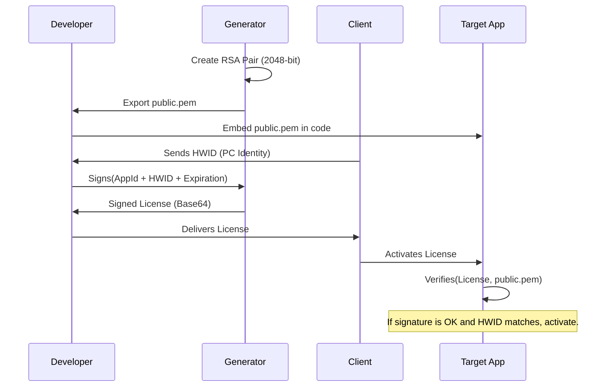

[🇪🇸 Español](docs/es/ARCHITECTURE.md) | 🇺🇸 **English** | [🇩🇪 Deutsch](docs/de/ARCHITECTURE.md) | [🇧🇷 Português](docs/pt/ARCHITECTURE.md) | [🇨🇳 中文](docs/zh/README.md)

# 🏗️ System Architecture: License Ecosystem

This document details the technical design and security principles underlying the License Generator.

---

## 🔒 The Security Model: RSA + SHA256

The system uses a **One-Way Trust** scheme based on RSA. The developer has the power to "sign" (Private Key), and applications only have the power to "verify" (Public Key).

### Cryptographic Flow



---

## 🛠️ Design Fundamentals

### 1. PEM Standardization (PKCS#8)
Unlike older XML formats in .NET, this tool uses the **PEM (Privacy-Enhanced Mail)** standard.
- **Interoperability**: The Base64 format delimited by `-----BEGIN...` headers is the global standard. Any programming language (Python, Node.js, Java, Go, Rust, etc.) can read these keys directly without adapters or conversions.
- **Portability**: Generated licenses are RSA-signed JSON — a universal format. Your client app can be written in any technology, it doesn't need to be .NET.
- **Security**: Implements PKCS#8 for the private key and SubjectPublicKeyInfo for the public key.
- **Algorithm**: RSA 2048-bit + SHA256 + PKCS1v15 padding — the most widely supported signing scheme in the industry.

### 2. Hardware Binding (HWID)
Security is not just based on the signature, but on the **physical link**.
1. The client application generates an identifier based on PC components (CPU, Motherboard, or Windows MachineGuid).
2. The Generator includes this ID within the signed license package.
3. The validator on the client recreates the local hardware ID and compares it with the signed ID.
4. **Result**: If a user pirates the license file and moves it to another PC, the HWID will not match, and the validator will reject it, even if the cryptographic signature is perfect.

### 3. Contract Integrity (`GetDataToSign`)
To prevent tampering attacks (like manually changing the expiration date in the JSON file), the system signs a **consolidated block**.

`Signature = RSA_Sign(AppId | Name | HWID | Expiration)`

If a single bit is changed in the license (e.g., from 2024 to 2030), the client will generate a different block and the signature will no longer be valid.

---

## 📂 Data Organization

The application follows the **Decoupled Storage** pattern:
- **Binaries**: The executable code can live anywhere.
- **Data Store (`AppData/Local`)**: Contains the keys and history.

```text
LicenseGenerator/
├── Keys/
│   ├── App1/
│   │   ├── public.pem
│   │   └── private.pem
│   └── App2/
│       └── ...
└── History.json      (Record of issued licenses)
```
---

## ⚖️ Legal and Usage Model

Unlike many security utilities, **License Generator** is not an open-source project without restrictions.

1. **Intellectual Property**: The design of the signing algorithms and the generator architecture are the property of the author.
2. **EULA License**: The software is governed by an End User License Agreement ([LICENSE](../../LICENSE)) that allows free use to manage licenses for your applications (commercial or otherwise), but strictly prohibits the sale, redistribution, or reverse engineering of the Generator itself.
3. **Liability**: The author is not responsible for the use made of the generated licenses nor for the security of the applications that integrate them.

> [!IMPORTANT]
> By using this tool, the developer accepts responsibility for the custody of their private keys and for the correct implementation on the client side.

---

> [!NOTE]
> This design allows updating the generator without ever touching your master keys or losing your client history.
