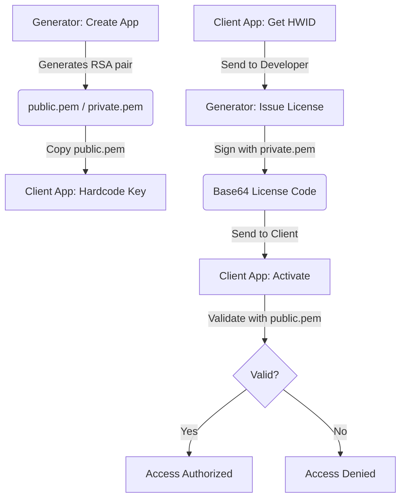

# 📔 LicenseGenerator Operations and Integration Guide

[🇪🇸 Español](docs/es/OPERATIONS.md) | 🇺🇸 **English** | [🇩🇪 Deutsch](docs/de/OPERATIONS.md) | [🇧🇷 Português](docs/pt/OPERATIONS.md) | [🇨🇳 中文](docs/zh/README.md)

This guide is the complete manual for operating the Generator and, above all, for **integrating the licensing system into your own applications** professionally — regardless of the programming language you use.

> [!TIP]
> **The Big Advantage**: This system is designed for developers who do not want (or cannot) maintain a complex server infrastructure. It allows you to manage and sell licenses for **all your apps** simply, organized, and completely offline. No external databases, no APIs, no monthly maintenance costs. Just you and your keys.

---

## 🔄 Flow Overview

For a licensing system to work, the **Generator** (your admin tool) and the **Client** (the end-user app) must be synchronized via RSA cryptography. They only need to share **one thing**: the public key.



**Why does it work?** Because the private key (which only you have) signs the data, and the public key (which you embed in your app) can only **verify** that signature, never create it. A pirate would need your private key to generate valid licenses for your app — and that key never leaves your computer.

---

## 🛠 Phase 1: Preparation in the Generator

Before touching a single line of code in your application, you must register it in the Generator. This tells the system: "I'm going to need licenses for this product."

1.  **Start the Generator**: Open the `LicenseGenerator` application.
2.  **App Management**: Go to the corresponding tab and create a new entry with a descriptive **AppID** (e.g., `MySuperApp`). This name is important — it links the licenses to your product.
3.  **The Export Moment**: As soon as you press "Create App", the tool automatically does the following:
    -   Generates a unique **2048-bit** RSA key pair for that App.
    -   **EXPORTS** the PEM files to the folder:
        `%LocalAppData%\LicenseGenerator\Keys\MySuperApp\`
4.  **Locate your Public Key**: Open the `public.pem` file that just appeared in that folder. **This is the key your app will use to verify that the licenses are yours.** Don't lose it — although if you do, you can always copy it again from that path.

> [!CAUTION]
> **Never distribute the `private.pem` file.** It is your private key. If someone gets it, they can generate valid licenses for your app. Treat it like a master password.

---

## 📋 Centralized Management per Application

**License Generator** acts as your centralized control panel for all your products:

-   **Isolation**: Every application you register works as a watertight compartment. It has its own RSA keys and its own license history. The keys for `MySuperApp` have no relation to those of `OtherApp`.
-   **Tracking**: In the **History** tab, you can filter by application to see exactly who has an active license, when it was issued, and when it expires.
-   **Customer Support**: If a user has trouble with their license, simply search for their name or HWID in the history to resend their code. And if they changed computers (loss, theft, upgrade), you simply generate a new license with their new HWID — no intermediate servers, no complications, and no cost.
-   **State Control**: Being an offline system, the "state" of a license in the generator is an administrative record. The client application only verifies the signature locally — it doesn't need internet to check if its license is valid.

---

## 💻 Phase 2: Client Integration

This is the crucial part. This is where your application learns to verify licenses. The process is the same regardless of language: you need 3 fundamental pieces.

### Piece 1: The Data Contract (`LicenseData`)

This is the structure representing a license. **It must be identical in the Generator and in your app.** It is the "contract" between both sides.

The most critical part is the `GetDataToSign()` method: it generates the exact string that was signed. If this method produces a different result than the Generator, **the signature will always fail**.

````tabs
```tab=C# (.NET 6+)
public class LicenseData
{
    public string AppId { get; set; } = string.Empty;
    public string RegistrationName { get; set; } = string.Empty;
    public string HardwareId { get; set; } = string.Empty;
    public DateTime? ExpirationDate { get; set; }
    public string Signature { get; set; } = string.Empty;

    // CRITICAL: This method must be IDENTICAL in Generator and Client
    public string GetDataToSign()
    {
        var dateStr = ExpirationDate?.ToString("yyyy-MM-dd") ?? "NEVER";
        return $"{AppId}|{RegistrationName}|{HardwareId}|{dateStr}";
    }
}
```
```tab=Python
import json
from dataclasses import dataclass, field
from datetime import datetime
from typing import Optional

@dataclass
class LicenseData:
    AppId: str = ""
    RegistrationName: str = ""
    HardwareId: str = ""
    ExpirationDate: Optional[str] = None  # format "yyyy-MM-ddTHH:mm:ss"
    Signature: str = ""

    def get_data_to_sign(self) -> str:
        """CRITICAL: Must produce the same string as the C# Generator"""
        if self.ExpirationDate:
            # Parse ISO date and extract only yyyy-MM-dd
            date_str = datetime.fromisoformat(self.ExpirationDate).strftime("%Y-%m-%d")
        else:
            date_str = "NEVER"
        return f"{self.AppId}|{self.RegistrationName}|{self.HardwareId}|{date_str}"
```
```tab=Node.js
class LicenseData {
    constructor(data = {}) {
        this.AppId = data.AppId || '';
        this.RegistrationName = data.RegistrationName || '';
        this.HardwareId = data.HardwareId || '';
        this.ExpirationDate = data.ExpirationDate || null;
        this.Signature = data.Signature || '';
    }

    // CRITICAL: Must produce the same string as the C# Generator
    getDataToSign() {
        let dateStr = 'NEVER';
        if (this.ExpirationDate) {
            const d = new Date(this.ExpirationDate);
            dateStr = d.toISOString().split('T')[0]; // "yyyy-MM-dd"
        }
        return `${this.AppId}|${this.RegistrationName}|${this.HardwareId}|${dateStr}`;
    }
}
```
````

> [!IMPORTANT]
> **The Golden Rule**: `GetDataToSign()` must produce **exactly** the string `AppId|Name|HWID|yyyy-MM-dd` (or `NEVER`). A single character difference (a space, a capital letter, a different date format) will make the signature invalid. The separator is always `|`.

---

### Piece 2: The Hardware Identifier (HWID)

The HWID is what prevents a user from copying their license to another PC. The idea is simple: your app generates a unique identifier based on the computer hardware, and that identifier is included inside the signature. If the license travels to another PC, the HWID will not match.

**You can use whatever method you want** to generate the HWID, but it must follow two rules:
1.  **Deterministic**: The same machine always generates the same ID.
2.  **Identical**: The format your app shows the user (to send to you) must be exactly the one used later to validate.

The Generator does not enforce any HWID format — it simply signs what it receives. **You decide how to generate it.**

````tabs
```tab=C# (.NET — Windows + Linux)
public string GetMachineId()
{
    try
    {
        string id = string.Empty;

        if (RuntimeInformation.IsOSPlatform(OSPlatform.Windows))
        {
            // Windows: MachineGuid from registry (unique per Windows installation)
            using var key = Registry.LocalMachine.OpenSubKey(@"SOFTWARE\Microsoft\Cryptography");
            id = key?.GetValue("MachineGuid")?.ToString() ?? string.Empty;
        }
        else if (RuntimeInformation.IsOSPlatform(OSPlatform.Linux))
        {
            // Linux: /etc/machine-id is standard in systemd
            if (File.Exists("/etc/machine-id"))
                id = File.ReadAllText("/etc/machine-id").Trim();
            else if (File.Exists("/var/lib/dbus/machine-id"))
                id = File.ReadAllText("/var/lib/dbus/machine-id").Trim();
        }
        else if (RuntimeInformation.IsOSPlatform(OSPlatform.OSX))
        {
            // macOS: IOPlatformSerialNumber via ioreg
            var p = Process.Start(new ProcessStartInfo("ioreg", "-rd1 -c IOPlatformExpertDevice")
                { RedirectStandardOutput = true, UseShellExecute = false });
            var output = p?.StandardOutput.ReadToEnd() ?? "";
            var match = Regex.Match(output, "\"IOPlatformSerialNumber\" = \"(.+?)\"");
            if (match.Success) id = match.Groups[1].Value;
        }

        if (string.IsNullOrEmpty(id)) return "GENERIC-HWID";

        // Friendly format: first 8 chars, uppercase
        return id.Replace("-", "").Substring(0, 8).ToUpper();
    }
    catch { return "UNKNOWN-HWID"; }
}
```
```tab=Python
import platform, subprocess, re, uuid

def get_machine_id() -> str:
    """Gets an 8-char HWID from current machine."""
    system = platform.system()
    raw_id = ""

    if system == "Windows":
        import winreg
        key = winreg.OpenKey(winreg.HKEY_LOCAL_MACHINE, r"SOFTWARE\Microsoft\Cryptography")
        raw_id = winreg.QueryValueEx(key, "MachineGuid")[0]
    elif system == "Linux":
        for path in ["/etc/machine-id", "/var/lib/dbus/machine-id"]:
            try:
                raw_id = open(path).read().strip()
                break
            except FileNotFoundError:
                continue
    elif system == "Darwin":  # macOS
        out = subprocess.check_output(["ioreg", "-rd1", "-c", "IOPlatformExpertDevice"]).decode()
        match = re.search(r'"IOPlatformSerialNumber" = "(.+?)"', out)
        if match:
            raw_id = match.group(1)

    if not raw_id:
        raw_id = str(uuid.getnode())  # Fallback: MAC address

    return raw_id.replace("-", "")[:8].upper()
```
```tab=Node.js
const os = require('os');
const crypto = require('crypto');
const { execSync } = require('child_process');

function getMachineId() {
    let rawId = '';

    if (process.platform === 'win32') {
        // Windows: reads MachineGuid from registry
        const output = execSync(
            'reg query HKLM\\SOFTWARE\\Microsoft\\Cryptography /v MachineGuid'
        ).toString();
        const match = output.match(/MachineGuid\s+REG_SZ\s+(.+)/);
        if (match) rawId = match[1].trim();
    } else if (process.platform === 'linux') {
        const fs = require('fs');
        for (const p of ['/etc/machine-id', '/var/lib/dbus/machine-id']) {
            try { rawId = fs.readFileSync(p, 'utf-8').trim(); break; } catch {}
        }
    } else if (process.platform === 'darwin') {
        const out = execSync('ioreg -rd1 -c IOPlatformExpertDevice').toString();
        const match = out.match(/"IOPlatformSerialNumber" = "(.+?)"/);
        if (match) rawId = match[1];
    }

    if (!rawId) rawId = os.hostname(); // Fallback
    return rawId.replace(/-/g, '').substring(0, 8).toUpperCase();
}
```
````

> [!NOTE]
> **Why 8 characters?** Just for usability. A full GUID like `a8c3f1e2-b456-7890-cdef-1234567890ab` is hard to dictate over the phone or type. The first 8 characters (`A8C3F1E2`) are enough to differentiate millions of computers and the user can easily copy them.

---

### Piece 3: The License Service (Complete)

This is where everything comes together. This is the complete service your app needs, with 4 essential functions:

1.  **`GetMachineId()`** — To show the user their HWID so they can send it to you.
2.  **`Activate(code)`** — To decode and validate the Base64 you deliver to the client.
3.  **`IsLicensed()`** — To quickly check if there is an active license (called on startup).
4.  **`Validate(license)`** — The RSA cryptographic verification itself.

````tabs
```tab=C# (.NET 6+) — Complete Implementation
using System.Security.Cryptography;
using System.Text;
using System.Text.Json;

public interface ILicenseService
{
    bool IsLicensed();
    bool Activate(string licenseKey);
    LicenseData? GetCurrentLicense();
    string GetMachineId();
}

public class LicenseService : ILicenseService
{
    private const string AppId = "MySuperApp";     // Must match ID in Generator
    private const string LicenseFileName = "license.lic";

    // PASTED FROM public.pem EXPORTED BY GENERATOR
    private const string PublicKeyPem = @"-----BEGIN PUBLIC KEY-----
HERE_GOES_YOUR_FULL_PUBLIC_KEY
WITH_HEADERS_AND_EVERYTHING
-----END PUBLIC KEY-----";

    private LicenseData? _cachedLicense;

    // ══════════════════════════════════════════════════════════════
    // 1. CHECK: Is there a valid license? (Call on startup)
    // ══════════════════════════════════════════════════════════════
    public bool IsLicensed()
    {
        if (_cachedLicense != null) return true;

        // Try load from disk (if already activated)
        var license = LoadFromFile();
        if (license != null && Validate(license))
        {
            _cachedLicense = license;
            return true;
        }
        return false;
    }

    // ══════════════════════════════════════════════════════════════
    // 2. ACTIVATE: User pastes Base64 code you sent
    // ══════════════════════════════════════════════════════════════
    public bool Activate(string licenseKey)
    {
        try
        {
            // Generator produces: Base64 → containing JSON → containing data
            var json = Encoding.UTF8.GetString(Convert.FromBase64String(licenseKey));
            var license = JsonSerializer.Deserialize<LicenseData>(json);

            if (license != null && Validate(license))
            {
                SaveToFile(licenseKey);       // Persist for next startups
                _cachedLicense = license;
                return true;
            }
        }
        catch { /* Invalid format — code corrupt or copied wrong */ }
        return false;
    }

    public LicenseData? GetCurrentLicense() => _cachedLicense;

    // ══════════════════════════════════════════════════════════════
    // 3. VALIDATE: RSA Cryptographic Verification
    // ══════════════════════════════════════════════════════════════
    private bool Validate(LicenseData license)
    {
        // Is it for this app?
        if (license.AppId != AppId) return false;

        // Does hardware match?
        if (license.HardwareId != GetMachineId()) return false;

        // Expired?
        if (license.ExpirationDate.HasValue && license.ExpirationDate < DateTime.Now) return false;

        try
        {
            // RSA signature: import public key and verify
            using var rsa = RSA.Create();
            rsa.ImportFromPem(PublicKeyPem);

            var data = Encoding.UTF8.GetBytes(license.GetDataToSign());
            var signature = Convert.FromBase64String(license.Signature);

            return rsa.VerifyData(data, signature, HashAlgorithmName.SHA256, RSASignaturePadding.Pkcs1);
        }
        catch { return false; }
    }

    // ══════════════════════════════════════════════════════════════
    // 4. HWID: Unique PC Identity (see previous section)
    // ══════════════════════════════════════════════════════════════
    public string GetMachineId()
    {
        // ... (use implementation from previous section)
    }

    // ══════════════════════════════════════════════════════════════
    // Persistence: Save/Load from disk
    // ══════════════════════════════════════════════════════════════
    private void SaveToFile(string licenseKey)
    {
        File.WriteAllText(GetLicensePath(), licenseKey);
    }

    private LicenseData? LoadFromFile()
    {
        var path = GetLicensePath();
        if (!File.Exists(path)) return null;
        try
        {
            var key = File.ReadAllText(path);
            var json = Encoding.UTF8.GetString(Convert.FromBase64String(key));
            return JsonSerializer.Deserialize<LicenseData>(json);
        }
        catch { return null; }
    }

    private string GetLicensePath()
    {
        var dir = Path.Combine(
            Environment.GetFolderPath(Environment.SpecialFolder.LocalApplicationData),
            AppId  // Each app saves its license in its own folder
        );
        if (!Directory.Exists(dir)) Directory.CreateDirectory(dir);
        return Path.Combine(dir, LicenseFileName);
    }
}
```
```tab=Python — Complete Implementation
import base64, json, os, platform
from cryptography.hazmat.primitives import hashes, serialization
from cryptography.hazmat.primitives.asymmetric import padding, utils

# pip install cryptography

APP_ID = "MySuperApp"
LICENSE_FILE = "license.lic"

# PASTED FROM public.pem EXPORTED BY GENERATOR
PUBLIC_KEY_PEM = """-----BEGIN PUBLIC KEY-----
HERE_GOES_YOUR_FULL_PUBLIC_KEY
WITH_HEADERS_AND_EVERYTHING
-----END PUBLIC KEY-----"""

_cached_license = None

def get_license_path() -> str:
    """Path where activated license is saved."""
    if platform.system() == "Windows":
        base = os.environ.get("LOCALAPPDATA", os.path.expanduser("~"))
    else:
        base = os.path.expanduser("~/.local/share")
    directory = os.path.join(base, APP_ID)
    os.makedirs(directory, exist_ok=True)
    return os.path.join(directory, LICENSE_FILE)

def validate(license: 'LicenseData') -> bool:
    """Full RSA cryptographic verification."""
    if license.AppId != APP_ID:
        return False
    if license.HardwareId != get_machine_id():
        return False
    if license.ExpirationDate:
        from datetime import datetime
        exp = datetime.fromisoformat(license.ExpirationDate)
        if exp < datetime.now():
            return False
    try:
        public_key = serialization.load_pem_public_key(PUBLIC_KEY_PEM.encode())
        data = license.get_data_to_sign().encode("utf-8")
        signature = base64.b64decode(license.Signature)
        public_key.verify(
            signature,
            data,
            padding.PKCS1v15(),
            hashes.SHA256()
        )
        return True
    except Exception:
        return False

def activate(license_key: str) -> bool:
    """Decodes Generator Base64, validates, and persists."""
    global _cached_license
    try:
        json_str = base64.b64decode(license_key).decode("utf-8")
        data = json.loads(json_str)
        license = LicenseData(**data)
        if validate(license):
            with open(get_license_path(), "w") as f:
                f.write(license_key)
            _cached_license = license
            return True
    except Exception:
        pass
    return False

def is_licensed() -> bool:
    """Checks if there is a valid license (on app startup)."""
    global _cached_license
    if _cached_license:
        return True
    path = get_license_path()
    if not os.path.exists(path):
        return False
    try:
        key = open(path).read()
        json_str = base64.b64decode(key).decode("utf-8")
        data = json.loads(json_str)
        license = LicenseData(**data)
        if validate(license):
            _cached_license = license
            return True
    except Exception:
        pass
    return False
```
```tab=Node.js — Complete Implementation
const crypto = require('crypto');
const fs = require('fs');
const path = require('path');
const os = require('os');

const APP_ID = 'MySuperApp';
const LICENSE_FILE = 'license.lic';

// PASTED FROM public.pem EXPORTED BY GENERATOR
const PUBLIC_KEY_PEM = `-----BEGIN PUBLIC KEY-----
HERE_GOES_YOUR_FULL_PUBLIC_KEY
WITH_HEADERS_AND_EVERYTHING
-----END PUBLIC KEY-----`;

let cachedLicense = null;

function getLicensePath() {
    const base = process.platform === 'win32'
        ? process.env.LOCALAPPDATA || os.homedir()
        : path.join(os.homedir(), '.local', 'share');
    const dir = path.join(base, APP_ID);
    if (!fs.existsSync(dir)) fs.mkdirSync(dir, { recursive: true });
    return path.join(dir, LICENSE_FILE);
}

function validate(license) {
    if (license.AppId !== APP_ID) return false;
    if (license.HardwareId !== getMachineId()) return false;
    if (license.ExpirationDate && new Date(license.ExpirationDate) < new Date()) return false;
    try {
        const data = Buffer.from(license.getDataToSign(), 'utf-8');
        const signature = Buffer.from(license.Signature, 'base64');
        const verify = crypto.createVerify('SHA256');
        verify.update(data);
        return verify.verify(PUBLIC_KEY_PEM, signature);
    } catch { return false; }
}

function activate(licenseKey) {
    try {
        const json = Buffer.from(licenseKey, 'base64').toString('utf-8');
        const data = JSON.parse(json);
        const license = new LicenseData(data);
        if (validate(license)) {
            fs.writeFileSync(getLicensePath(), licenseKey);
            cachedLicense = license;
            return true;
        }
    } catch {}
    return false;
}

function isLicensed() {
    if (cachedLicense) return true;
    const licensePath = getLicensePath();
    if (!fs.existsSync(licensePath)) return false;
    try {
        const key = fs.readFileSync(licensePath, 'utf-8');
        const json = Buffer.from(key, 'base64').toString('utf-8');
        const data = JSON.parse(json);
        const license = new LicenseData(data);
        if (validate(license)) {
            cachedLicense = license;
            return true;
        }
    } catch {}
    return false;
}
```
````

**What does each part do, step by step?**

1.  The Generator produces a JSON with `AppId`, `RegistrationName`, `HardwareId`, `ExpirationDate` and `Signature`, all encoded in **Base64**. That Base64 block is what you send to the client.
2.  The client **decodes** the Base64 → gets the JSON → deserializes to `LicenseData`.
3.  The validator **reconstructs** the `GetDataToSign()` string and uses the public key to verify that string was signed by your private key.
4.  If it passes, a `license.lic` file is saved in the user's AppData so they don't have to activate again every time they open the app.

---

## 🎨 Phase 3: Activation Screen in your App

Your app needs a screen where the user can:
- **See their HWID** (to send it to you).
- **Paste the license code** you sent them.
- **Activate** and see the result.

It doesn't matter if your interface is console, web, or desktop. The concept is the same:

```
┌──────────────────────────────────────────────┐
│           🔑 License Activation              │
│                                              │
│  Your Machine ID: [ A8C3F1E2 ]  [📋 Copy]   │
│                                              │
│  License Code:                               │
│  ┌──────────────────────────────────────┐    │
│  │ (User pastes Base64 here)            │    │
│  └──────────────────────────────────────┘    │
│                                              │
│               [ ✅ Activate ]                │
│                                              │
│  Status: ❌ Unlicensed                       │
└──────────────────────────────────────────────┘
```

**The end-user flow is:**
1.  Open your app → see activation screen.
2.  Copy HWID and send it to you (email, web form, etc.).
3.  You open Generator → select app → paste HWID → press Generate.
4.  Send the resulting Base64 code to them.
5.  Client pastes it in their app → presses Activate → done.

---

## 🎫 Phase 4: Issuing Licenses (Your Day-to-Day)

When a client wants to buy your app, the process is quick:

1.  **Ask for their HWID**: Your client app already has the "Copy ID" button.
2.  **Open Generator**: Select the corresponding App.
3.  **Fill in details**:
    -   **Client**: Buyer's name (for your records).
    -   **HWID**: The 8-character code they sent you.
    -   **Expiration**: Pick a date or leave empty for lifetime license.
4.  **Generate**: Press the button and you get a long Base64 block.
5.  **Send**: Copy that block and send it to the client however you prefer.

> [!NOTE]
> Each generated license is automatically recorded in the Generator's **History**. You can check it anytime to see how many licenses you've issued, to whom, and when they expire.

---

## 🚫 Irreversibility and Revocation

> [!CAUTION]
> **Signature is Permanent**: Because this system uses offline asymmetric cryptography, a signed license is technically valid forever (or until expiration) on the client PC, without needing internet.

**Can I revoke a license I already delivered?**

-   **Remotely: NO.** Since there is no central server the client checks on startup, you cannot "turn off" a license remotely.
-   **With a blacklist: YES.** You can implement a "Blacklist" in your next app update. If you include a list of revoked signatures in your code, validation can reject those licenses even if the RSA signature is correct.
-   **By major version: YES.** If you change the **Public Key** in a new version (e.g. V1 to V2), all previous licenses will stop working for that version. This is useful for charging for major upgrades.

---

## 🌍 Tech Stack Compatibility

This system is **NOT** limited to .NET / C#. The Generator uses industrial cryptographic standards that any language supports:

| Component | Standard Used | Universal? |
|:---|:---|:---|
| RSA Keys | **PEM (PKCS#8 / SubjectPublicKeyInfo)** | ✅ Yes — global format |
| Signing Algo | **RSA + SHA256 + PKCS1v15** | ✅ Yes — available in every crypto lib |
| License Format | **JSON encoded in Base64** | ✅ Yes — depends on nothing .NET |
| Signature Format | **Base64** | ✅ Yes — universal |

**You can validate licenses in any stack:**

| Language/Stack | RSA/PEM Library | Difficulty |
|:---|:---|:---|
| **C# / .NET 6+** | `System.Security.Cryptography` (native) | ⭐ Trivial |
| **Python** | `cryptography` (pip install) | ⭐ Trivial |
| **Node.js** | `crypto` (native module) | ⭐ Trivial |
| **Java / Kotlin** | `java.security` (native) | ⭐⭐ Easy (needs KeyFactory) |
| **Rust** | `rsa` + `pem` crates | ⭐⭐ Easy |
| **Go** | `crypto/rsa` (stdlib) | ⭐⭐ Easy |
| **Swift** | `Security` framework | ⭐⭐ Easy |
| **Electron / Web** | Node.js `crypto` or Web Crypto API | ⭐⭐ Easy |

> [!TIP]
> **The Generator is an administration tool.** It lives on your PC as a desktop app (.NET). But the licenses it produces are **RSA-signed JSON files** — a format any program in any language can read and verify. Your client app can be made in Python, Java, React, Electron, Flutter, or whatever.

---

## ⚠️ Troubleshooting

| Problem | Probable Cause | Solution |
| :--- | :--- | :--- |
| **"Signature Error"** | Public key doesn't match private key used to sign, or `GetDataToSign()` produces different string. | Re-copy full `public.pem` content (with `BEGIN/END` headers). Verify `\|` separators are correct. |
| **"License not valid on this PC"** | HWID generated on client PC is different from what you entered when signing. | Ensure your app uses **exact same** HWID algorithm the Generator received. Watch out for case sensitivity. |
| **"License expired"** | Client PC date is after `ExpirationDate`. | Generate new license with extended date. |
| **"Error importing PEM"** (C#) | Missing `System.Security.Cryptography` or using .NET < 6. | Update to .NET 6+ which includes native `ImportFromPem()`. |
| **"Error importing PEM"** (Python) | Missing `cryptography` library. | Run `pip install cryptography`. |
| **License works in dev but not prod** | Published app uses different HWID (e.g. Docker container has different `machine-id`). | Verify production environment allows access to same hardware data. |
