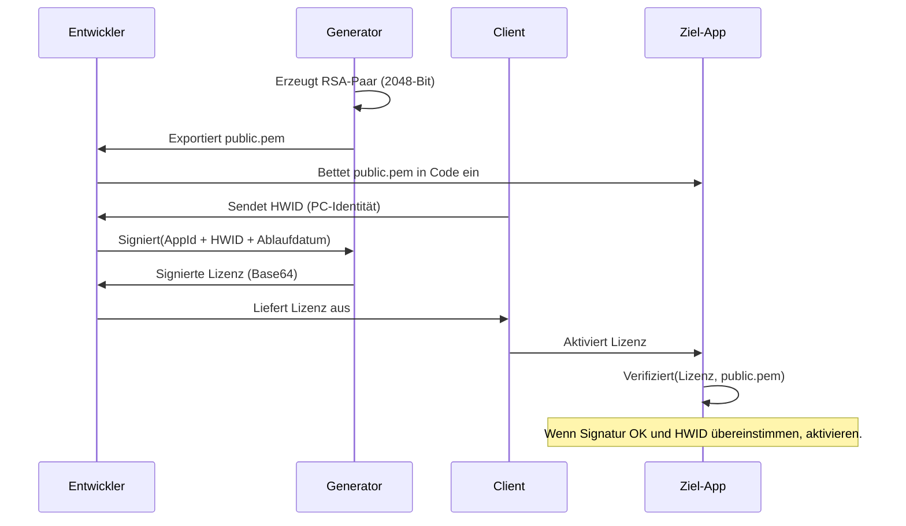

# 🏗️ Systemarchitektur: Lizenz-Ökosystem

[🇪🇸 Español](../es/ARCHITECTURE.md) | [🇺🇸 English](../../ARCHITECTURE.md) | 🇩🇪 **Deutsch** | [🇧🇷 Português](../pt/ARCHITECTURE.md) | [🇨🇳 中文](../zh/README.md)

Dieses Dokument beschreibt das technische Design und die Sicherheitsprinzipien, die dem License Generator zugrunde liegen.

---

## 🔒 Das Sicherheitsmodell: RSA + SHA256

Das System verwendet ein **Einweg-Vertrauensschema** (One-Way Trust) basierend auf RSA. Der Entwickler hat die Macht zu "signieren" (Privater Schlüssel), und Anwendungen haben nur die Macht zu "verifizieren" (Öffentlicher Schlüssel).

### Kryptographischer Ablauf



---

## 🛠️ Design-Grundlagen

### 1. PEM-Standardisierung (PKCS#8)
Im Gegensatz zu älteren XML-Formaten in .NET verwendet dieses Tool den **PEM (Privacy-Enhanced Mail)**-Standard.
- **Interoperabilität**: Das durch `-----BEGIN...`-Header begrenzte Base64-Format ist der globale Standard. Jede Programmiersprache (Python, Node.js, Java, Go, Rust usw.) kann diese Schlüssel direkt ohne Adapter oder Konvertierungen lesen.
- **Portabilität**: Generierte Lizenzen sind RSA-signiertes JSON – ein universelles Format. Ihre Client-App kann in jeder Technologie geschrieben sein, sie muss nicht .NET sein.
- **Sicherheit**: Implementiert PKCS#8 für den privaten Schlüssel und SubjectPublicKeyInfo für den öffentlichen Schlüssel.
- **Algorithmus**: RSA 2048-Bit + SHA256 + PKCS1v15-Padding – das am weitesten verbreitete Signaturschema in der Industrie.

### 2. Hardware-Bindung (HWID)
Sicherheit basiert nicht nur auf der Signatur, sondern auf der **physischen Bindung**.
1. Die Client-Anwendung generiert eine Kennung basierend auf PC-Komponenten (CPU, Mainboard oder Windows MachineGuid).
2. Der Generator fügt diese ID in das signierte Lizenzpaket ein.
3. Der Validator auf dem Client erstellt die lokale Hardware-ID neu und vergleicht sie mit der signierten ID.
4. **Ergebnis**: Wenn ein Benutzer die Lizenzdatei raubkopiert und auf einen anderen PC überträgt, stimmt die HWID nicht überein, und der Validator weist sie zurück, selbst wenn die kryptographische Signatur perfekt ist.

### 3. Vertragsintegrität (`GetDataToSign`)
Um Manipulationsangriffe zu verhindern (wie das manuelle Ändern des Ablaufdatums in der JSON-Datei), signiert das System einen **konsolidierten Block**.

`Signatur = RSA_Sign(AppId | Name | HWID | Ablaufdatum)`

Wenn ein einzelnes Bit in der Lizenz geändert wird (z. B. von 2024 auf 2030), generiert der Client einen anderen Block und die Signatur ist nicht mehr gültig.

---

## 📂 Datenorganisation

Die Anwendung folgt dem Muster der **Entkoppelten Speicherung**:
- **Binärdateien**: Der ausführbare Code kann überall liegen.
- **Datenspeicher (`AppData/Local`)**: Enthält die Schlüssel und den Verlauf.

```text
LicenseGenerator/
├── Keys/
│   ├── App1/
│   │   ├── public.pem
│   │   └── private.pem
│   └── App2/
│       └── ...
└── History.json      (Verzeichnis der ausgestellten Lizenzen)
```
---

## ⚖️ Rechts- und Nutzungsmodell

Im Gegensatz zu vielen Sicherheitsutilities ist **License Generator** kein Open-Source-Projekt ohne Einschränkungen.

1. **Geistiges Eigentum**: Das Design der Signaturalgorithmen und die Architektur des Generators sind Eigentum des Autors.
2. **EULA-Lizenz**: Die Software unterliegt einer Endbenutzer-Lizenzvereinbarung ([LICENSE](../../LICENSE)), die die kostenlose Nutzung zur Verwaltung von Lizenzen für Ihre Anwendungen (kommerziell oder nicht) erlaubt, aber den Verkauf, die Weiterverbreitung oder das Reverse Engineering des Generators selbst strengstens untersagt.
3. **Haftung**: Der Autor ist nicht verantwortlich für die Verwendung der generierten Lizenzen oder die Sicherheit der Anwendungen, die sie integrieren.

> [!IMPORTANT]
> Durch die Verwendung dieses Tools akzeptiert der Entwickler die Verantwortung für die Aufbewahrung seiner privaten Schlüssel und für die korrekte Implementierung auf der Client-Seite.

---

> [!NOTE]
> Dieses Design ermöglicht es, den Generator zu aktualisieren, ohne jemals Ihre Hauptschlüssel zu berühren oder Ihren Kundenverlauf zu verlieren.
