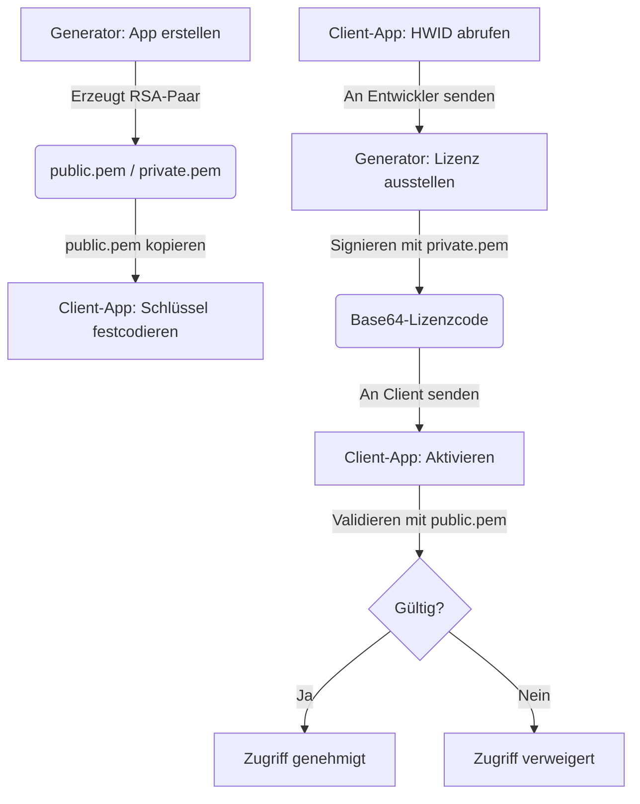

# 📔 LicenseGenerator Betriebs- und Integrationsanleitung

[🇪🇸 Español](../es/OPERATIONS.md) | [🇺🇸 English](../../OPERATIONS.md) | 🇩🇪 **Deutsch** | [🇧🇷 Português](../pt/OPERATIONS.md) | [🇨🇳 中文](../zh/README.md)

Dieser Leitfaden ist das vollständige Handbuch für den Betrieb des Generators und vor allem für die **Integration des Lizenzsystems in Ihre eigenen Anwendungen** auf professionelle Weise – unabhängig von der verwendeten Programmiersprache.

> [!TIP]
> **Der große Vorteil**: Dieses System ist für Entwickler konzipiert, die keine komplexe Serverinfrastruktur unterhalten wollen (oder können). Es ermöglicht Ihnen, Lizenzen für **alle Ihre Apps** einfach, organisiert und vollständig offline zu verwalten und zu verkaufen. Keine externen Datenbanken, keine APIs, keine monatlichen Wartungskosten. Nur Sie und Ihre Schlüssel.

---

## 🔄 Überblick über den Ablauf

Damit ein Lizenzsystem funktioniert, müssen der **Generator** (Ihr Admin-Tool) und der **Client** (die Endbenutzer-App) über RSA-Kryptographie synchronisiert sein. Sie müssen nur **eine Sache** teilen: den öffentlichen Schlüssel.



**Warum funktioniert das?** Weil der private Schlüssel (den nur Sie haben) die Daten signiert und der öffentliche Schlüssel (den Sie in Ihre App einbetten) diese Signatur nur **verifizieren**, aber niemals erstellen kann. Ein Raubkopierer bräuchte Ihren privaten Schlüssel, um gültige Lizenzen für Ihre App zu generieren – und dieser Schlüssel verlässt niemals Ihren Computer.

---

## 🛠 Phase 1: Vorbereitung im Generator

Bevor Sie eine einzige Zeile Code in Ihrer Anwendung anfassen, müssen Sie sie im Generator registrieren. Das sagt dem System: "Ich werde Lizenzen für dieses Produkt benötigen."

1.  **Starten Sie den Generator**: Öffnen Sie die Anwendung `LicenseGenerator`.
2.  **App-Verwaltung**: Gehen Sie zum entsprechenden Reiter und erstellen Sie einen neuen Eintrag mit einer beschreibenden **AppID** (z. B. `MeineSuperApp`). Dieser Name ist wichtig – er verknüpft die Lizenzen mit Ihrem Produkt.
3.  **Der Export-Moment**: Sobald Sie auf "App erstellen" klicken, führt das Tool automatisch Folgendes aus:
    -   Generiert ein einzigartiges **2048-Bit** RSA-Schlüsselpaar für diese App.
    -   **EXPORTIERT** die PEM-Dateien in den Ordner:
        `%LocalAppData%\LicenseGenerator\Keys\MeineSuperApp\`
4.  **Finden Sie Ihren öffentlichen Schlüssel**: Öffnen Sie die Datei `public.pem`, die gerade in diesem Ordner erschienen ist. **Das ist der Schlüssel, den Ihre App verwenden wird, um zu überprüfen, ob die Lizenzen von Ihnen stammen.** Verlieren Sie ihn nicht – obwohl Sie ihn, falls doch, jederzeit wieder aus diesem Pfad kopieren können.

> [!CAUTION]
> **Verteilen Sie niemals die Datei `private.pem`.** Das ist Ihr privater Schlüssel. Wenn jemand ihn erhält, kann er gültige Lizenzen für Ihre App generieren. Behandeln Sie ihn wie ein Master-Passwort.

---

## 📋 Zentralisierte Verwaltung pro Anwendung

**License Generator** fungiert als Ihr zentrales Kontrollpanel für alle Ihre Produkte:

-   **Isolierung**: Jede Anwendung, die Sie registrieren, funktioniert wie ein wasserdichtes Abteil. Sie hat ihre eigenen RSA-Schlüssel und ihren eigenen Lizenzverlauf. Die Schlüssel für `MeineSuperApp` haben keine Beziehung zu denen von `AndereApp`.
-   **Nachverfolgung**: Im Reiter **Verlauf** können Sie nach Anwendung filtern, um genau zu sehen, wer eine aktive Lizenz hat, wann sie ausgestellt wurde und wann sie abläuft.
-   **Kundensupport**: Wenn ein Benutzer Probleme mit seiner Lizenz hat, suchen Sie einfach im Verlauf nach seinem Namen oder seiner HWID, um ihm seinen Code erneut zu senden. Und wenn er den Computer gewechselt hat (Verlust, Diebstahl, Upgrade), generieren Sie einfach eine neue Lizenz mit seiner neuen HWID – keine Zwischenserver, keine Komplikationen und keine Kosten.
-   **Statuskontrolle**: Da es sich um ein Offline-System handelt, ist der "Status" einer Lizenz im Generator ein administrativer Datensatz. Die Client-Anwendung verifiziert die Signatur nur lokal – sie benötigt kein Internet, um zu prüfen, ob ihre Lizenz gültig ist.

---

## 💻 Phase 2: Client-Integration

Das ist der entscheidende Teil. Hier lernt Ihre Anwendung, Lizenzen zu verifizieren. Der Prozess ist unabhängig von der Sprache derselbe: Sie benötigen 3 grundlegende Teile.

### Teil 1: Der Datenvertrag (`LicenseData`)

Dies ist die Struktur, die eine Lizenz repräsentiert. **Sie muss im Generator und in Ihrer App identisch sein.** Sie ist der "Vertrag" zwischen beiden Seiten.

Der kritischste Teil ist die Methode `GetDataToSign()`: Sie generiert exakt die Zeichenkette, die signiert wurde. Wenn diese Methode ein anderes Ergebnis liefert als der Generator, **wird die Signatur immer fehlschlagen**.

````tabs
```tab=C# (.NET 6+)
public class LicenseData
{
    public string AppId { get; set; } = string.Empty;
    public string RegistrationName { get; set; } = string.Empty;
    public string HardwareId { get; set; } = string.Empty;
    public DateTime? ExpirationDate { get; set; }
    public string Signature { get; set; } = string.Empty;

    // KRITISCH: Diese Methode muss im Generator und im Client IDENTISCH sein
    public string GetDataToSign()
    {
        var dateStr = ExpirationDate?.ToString("yyyy-MM-dd") ?? "NEVER";
        return $"{AppId}|{RegistrationName}|{HardwareId}|{dateStr}";
    }
}
```
```tab=Python
import json
from dataclasses import dataclass, field
from datetime import datetime
from typing import Optional

@dataclass
class LicenseData:
    AppId: str = ""
    RegistrationName: str = ""
    HardwareId: str = ""
    ExpirationDate: Optional[str] = None  # Format "yyyy-MM-ddTHH:mm:ss"
    Signature: str = ""

    def get_data_to_sign(self) -> str:
        """KRITISCH: Muss denselben String erzeugen wie der C# Generator"""
        if self.ExpirationDate:
            # ISO-Datum parsen und nur yyyy-MM-dd extrahieren
            date_str = datetime.fromisoformat(self.ExpirationDate).strftime("%Y-%m-%d")
        else:
            date_str = "NEVER"
        return f"{self.AppId}|{self.RegistrationName}|{self.HardwareId}|{date_str}"
```
```tab=Node.js
class LicenseData {
    constructor(data = {}) {
        this.AppId = data.AppId || '';
        this.RegistrationName = data.RegistrationName || '';
        this.HardwareId = data.HardwareId || '';
        this.ExpirationDate = data.ExpirationDate || null;
        this.Signature = data.Signature || '';
    }

    // KRITISCH: Muss denselben String erzeugen wie der C# Generator
    getDataToSign() {
        let dateStr = 'NEVER';
        if (this.ExpirationDate) {
            const d = new Date(this.ExpirationDate);
            dateStr = d.toISOString().split('T')[0]; // "yyyy-MM-dd"
        }
        return `${this.AppId}|${this.RegistrationName}|${this.HardwareId}|${dateStr}`;
    }
}
```
````

> [!IMPORTANT]
> **Die Goldene Regel**: `GetDataToSign()` muss **exakt** die Zeichenkette `AppId|Name|HWID|yyyy-MM-dd` (oder `NEVER`) erzeugen. Ein einziges abweichendes Zeichen (ein Leerzeichen, ein Großbuchstabe, ein anderes Datumsformat) macht die Signatur ungültig. Das Trennzeichen ist immer `|`.

---

### Teil 2: Der Hardware-Identifikator (HWID)

Die HWID verhindert, dass ein Benutzer seine Lizenz auf einen anderen PC kopiert. Die Idee ist einfach: Ihre App generiert eine eindeutige Kennung basierend auf der Computerhardware, und diese Kennung wird in die Signatur aufgenommen. Wenn die Lizenz auf einen anderen PC wandert, stimmt die HWID nicht überein.

**Sie können jede Methode verwenden**, die Sie wollen, um die HWID zu generieren, aber sie muss zwei Regeln befolgen:
1.  **Deterministisch**: Dieselbe Maschine generiert immer dieselbe ID.
2.  **Identisch**: Das Format, das Ihre App dem Benutzer anzeigt (zum Senden an Sie), muss genau das sein, das später zur Validierung verwendet wird.

Der Generator erzwingt kein HWID-Format – er signiert einfach, was er empfängt. **Sie entscheiden, wie es generiert wird.**

````tabs
```tab=C# (.NET — Windows + Linux)
public string GetMachineId()
{
    try
    {
        string id = string.Empty;

        if (RuntimeInformation.IsOSPlatform(OSPlatform.Windows))
        {
            // Windows: MachineGuid aus der Registry (eindeutig pro Windows-Installation)
            using var key = Registry.LocalMachine.OpenSubKey(@"SOFTWARE\Microsoft\Cryptography");
            id = key?.GetValue("MachineGuid")?.ToString() ?? string.Empty;
        }
        else if (RuntimeInformation.IsOSPlatform(OSPlatform.Linux))
        {
            // Linux: /etc/machine-id ist Standard in systemd
            if (File.Exists("/etc/machine-id"))
                id = File.ReadAllText("/etc/machine-id").Trim();
            else if (File.Exists("/var/lib/dbus/machine-id"))
                id = File.ReadAllText("/var/lib/dbus/machine-id").Trim();
        }
        else if (RuntimeInformation.IsOSPlatform(OSPlatform.OSX))
        {
            // macOS: IOPlatformSerialNumber via ioreg
            var p = Process.Start(new ProcessStartInfo("ioreg", "-rd1 -c IOPlatformExpertDevice")
                { RedirectStandardOutput = true, UseShellExecute = false });
            var output = p?.StandardOutput.ReadToEnd() ?? "";
            var match = Regex.Match(output, "\"IOPlatformSerialNumber\" = \"(.+?)\"");
            if (match.Success) id = match.Groups[1].Value;
        }

        if (string.IsNullOrEmpty(id)) return "GENERIC-HWID";

        // Freundliches Format: erste 8 Zeichen, Großbuchstaben
        return id.Replace("-", "").Substring(0, 8).ToUpper();
    }
    catch { return "UNKNOWN-HWID"; }
}
```
```tab=Python
import platform, subprocess, re, uuid

def get_machine_id() -> str:
    """Holt eine 8-stellige HWID vom aktuellen Rechner."""
    system = platform.system()
    raw_id = ""

    if system == "Windows":
        import winreg
        key = winreg.OpenKey(winreg.HKEY_LOCAL_MACHINE, r"SOFTWARE\Microsoft\Cryptography")
        raw_id = winreg.QueryValueEx(key, "MachineGuid")[0]
    elif system == "Linux":
        for path in ["/etc/machine-id", "/var/lib/dbus/machine-id"]:
            try:
                raw_id = open(path).read().strip()
                break
            except FileNotFoundError:
                continue
    elif system == "Darwin":  # macOS
        out = subprocess.check_output(["ioreg", "-rd1", "-c", "IOPlatformExpertDevice"]).decode()
        match = re.search(r'"IOPlatformSerialNumber" = "(.+?)"', out)
        if match:
            raw_id = match.group(1)

    if not raw_id:
        raw_id = str(uuid.getnode())  # Fallback: MAC-Adresse

    return raw_id.replace("-", "")[:8].upper()
```
```tab=Node.js
const os = require('os');
const crypto = require('crypto');
const { execSync } = require('child_process');

function getMachineId() {
    let rawId = '';

    if (process.platform === 'win32') {
        // Windows: liest MachineGuid aus der Registry
        const output = execSync(
            'reg query HKLM\\SOFTWARE\\Microsoft\\Cryptography /v MachineGuid'
        ).toString();
        const match = output.match(/MachineGuid\s+REG_SZ\s+(.+)/);
        if (match) rawId = match[1].trim();
    } else if (process.platform === 'linux') {
        const fs = require('fs');
        for (const p of ['/etc/machine-id', '/var/lib/dbus/machine-id']) {
            try { rawId = fs.readFileSync(p, 'utf-8').trim(); break; } catch {}
        }
    } else if (process.platform === 'darwin') {
        const out = execSync('ioreg -rd1 -c IOPlatformExpertDevice').toString();
        const match = out.match(/"IOPlatformSerialNumber" = "(.+?)"/);
        if (match) rawId = match[1];
    }

    if (!rawId) rawId = os.hostname(); // Fallback
    return rawId.replace(/-/g, '').substring(0, 8).toUpperCase();
}
```
````

> [!NOTE]
> **Warum 8 Zeichen?** Nur der Benutzerfreundlichkeit wegen. Eine volle GUID wie `a8c3f1e2-b456-7890-cdef-1234567890ab` ist schwer am Telefon zu diktieren oder abzutippen. Die ersten 8 Zeichen (`A8C3F1E2`) reichen aus, um Millionen von Computern zu unterscheiden, und der Benutzer kann sie leicht kopieren.

---

### Teil 3: Der Lizenzdienst (Komplett)

Hier kommt alles zusammen. Dies ist der vollständige Dienst, den Ihre App benötigt, mit 4 wesentlichen Funktionen:

1.  **`GetMachineId()`** — Um dem Benutzer seine HWID anzuzeigen, damit er sie Ihnen senden kann.
2.  **`Activate(code)`** — Um das Base64, das Sie an den Client liefern, zu dekodieren und zu validieren.
3.  **`IsLicensed()`** — Um schnell zu prüfen, ob eine aktive Lizenz vorliegt (wird beim Start aufgerufen).
4.  **`Validate(license)`** — Die RSA-kryptographische Verifizierung selbst.

````tabs
```tab=C# (.NET 6+) — Vollständige Implementierung
using System.Security.Cryptography;
using System.Text;
using System.Text.Json;

public interface ILicenseService
{
    bool IsLicensed();
    bool Activate(string licenseKey);
    LicenseData? GetCurrentLicense();
    string GetMachineId();
}

public class LicenseService : ILicenseService
{
    private const string AppId = "MeineSuperApp";     // Muss mit ID im Generator übereinstimmen
    private const string LicenseFileName = "license.lic";

    // EINGEFÜGT VOM public.pem, DEN DER GENERATOR EXPORTIERT HAT
    private const string PublicKeyPem = @"-----BEGIN PUBLIC KEY-----
HIER_KOMMT_IHR_VOLLSTÄNDIGER_PUBLIC_KEY_HIN
MIT_HEADERN_UND_ALLEM
-----END PUBLIC KEY-----";

    private LicenseData? _cachedLicense;

    // ══════════════════════════════════════════════════════════════
    // 1. PRÜFEN: Gibt es eine gültige Lizenz? (Beim Start aufrufen)
    // ══════════════════════════════════════════════════════════════
    public bool IsLicensed()
    {
        if (_cachedLicense != null) return true;

        // Versuchen, von der Festplatte zu laden (falls bereits aktiviert)
        var license = LoadFromFile();
        if (license != null && Validate(license))
        {
            _cachedLicense = license;
            return true;
        }
        return false;
    }

    // ══════════════════════════════════════════════════════════════
    // 2. AKTIVIEREN: Benutzer fügt Base64-Code ein, den Sie gesendet haben
    // ══════════════════════════════════════════════════════════════
    public bool Activate(string licenseKey)
    {
        try
        {
            // Generator erzeugt: Base64 → enthält JSON → enthält Daten
            var json = Encoding.UTF8.GetString(Convert.FromBase64String(licenseKey));
            var license = JsonSerializer.Deserialize<LicenseData>(json);

            if (license != null && Validate(license))
            {
                SaveToFile(licenseKey);       // Für nächste Starts speichern
                _cachedLicense = license;
                return true;
            }
        }
        catch { /* Ungültiges Format — Code korrupt oder falsch kopiert */ }
        return false;
    }

    public LicenseData? GetCurrentLicense() => _cachedLicense;

    // ══════════════════════════════════════════════════════════════
    // 3. VALIDIEREN: RSA-Kryptographische Verifizierung
    // ══════════════════════════════════════════════════════════════
    private bool Validate(LicenseData license)
    {
        // Ist es für diese App?
        if (license.AppId != AppId) return false;

        // Stimmt die Hardware überein?
        if (license.HardwareId != GetMachineId()) return false;

        // Abgelaufen?
        if (license.ExpirationDate.HasValue && license.ExpirationDate < DateTime.Now) return false;

        try
        {
            // RSA-Signatur: öffentlichen Schlüssel importieren und verifizieren
            using var rsa = RSA.Create();
            rsa.ImportFromPem(PublicKeyPem);

            var data = Encoding.UTF8.GetBytes(license.GetDataToSign());
            var signature = Convert.FromBase64String(license.Signature);

            return rsa.VerifyData(data, signature, HashAlgorithmName.SHA256, RSASignaturePadding.Pkcs1);
        }
        catch { return false; }
    }

    // ══════════════════════════════════════════════════════════════
    // 4. HWID: Eindeutige PC-Identität (siehe vorherigen Abschnitt)
    // ══════════════════════════════════════════════════════════════
    public string GetMachineId()
    {
        // ... (Implementierung aus vorherigem Abschnitt verwenden)
    }

    // ══════════════════════════════════════════════════════════════
    // Persistenz: Speichern/Laden von Festplatte
    // ══════════════════════════════════════════════════════════════
    private void SaveToFile(string licenseKey)
    {
        File.WriteAllText(GetLicensePath(), licenseKey);
    }

    private LicenseData? LoadFromFile()
    {
        var path = GetLicensePath();
        if (!File.Exists(path)) return null;
        try
        {
            var key = File.ReadAllText(path);
            var json = Encoding.UTF8.GetString(Convert.FromBase64String(key));
            return JsonSerializer.Deserialize<LicenseData>(json);
        }
        catch { return null; }
    }

    private string GetLicensePath()
    {
        var dir = Path.Combine(
            Environment.GetFolderPath(Environment.SpecialFolder.LocalApplicationData),
            AppId  // Jede App speichert ihre Lizenz in ihrem eigenen Ordner
        );
        if (!Directory.Exists(dir)) Directory.CreateDirectory(dir);
        return Path.Combine(dir, LicenseFileName);
    }
}
```
```tab=Python — Vollständige Implementierung
import base64, json, os, platform
from cryptography.hazmat.primitives import hashes, serialization
from cryptography.hazmat.primitives.asymmetric import padding, utils

# pip install cryptography

APP_ID = "MeineSuperApp"
LICENSE_FILE = "license.lic"

# EINGEFÜGT VOM public.pem, DEN DER GENERATOR EXPORTIERT HAT
PUBLIC_KEY_PEM = """-----BEGIN PUBLIC KEY-----
HIER_KOMMT_IHR_VOLLSTÄNDIGER_PUBLIC_KEY_HIN
MIT_HEADERN_UND_ALLEM
-----END PUBLIC KEY-----"""

_cached_license = None

def get_license_path() -> str:
    """Pfad, wo die aktivierte Lizenz gespeichert wird."""
    if platform.system() == "Windows":
        base = os.environ.get("LOCALAPPDATA", os.path.expanduser("~"))
    else:
        base = os.path.expanduser("~/.local/share")
    directory = os.path.join(base, APP_ID)
    os.makedirs(directory, exist_ok=True)
    return os.path.join(directory, LICENSE_FILE)

def validate(license: 'LicenseData') -> bool:
    """Vollständige RSA-kryptographische Verifizierung."""
    if license.AppId != APP_ID:
        return False
    if license.HardwareId != get_machine_id():
        return False
    if license.ExpirationDate:
        from datetime import datetime
        exp = datetime.fromisoformat(license.ExpirationDate)
        if exp < datetime.now():
            return False
    try:
        public_key = serialization.load_pem_public_key(PUBLIC_KEY_PEM.encode())
        data = license.get_data_to_sign().encode("utf-8")
        signature = base64.b64decode(license.Signature)
        public_key.verify(
            signature,
            data,
            padding.PKCS1v15(),
            hashes.SHA256()
        )
        return True
    except Exception:
        return False

def activate(license_key: str) -> bool:
    """Dekodiert Generator Base64, validiert und persistiert."""
    global _cached_license
    try:
        json_str = base64.b64decode(license_key).decode("utf-8")
        data = json.loads(json_str)
        license = LicenseData(**data)
        if validate(license):
            with open(get_license_path(), "w") as f:
                f.write(license_key)
            _cached_license = license
            return True
    except Exception:
        pass
    return False

def is_licensed() -> bool:
    """Prüft, ob eine gültige Lizenz vorliegt (beim App-Start)."""
    global _cached_license
    if _cached_license:
        return True
    path = get_license_path()
    if not os.path.exists(path):
        return False
    try:
        key = open(path).read()
        json_str = base64.b64decode(key).decode("utf-8")
        data = json.loads(json_str)
        license = LicenseData(**data)
        if validate(license):
            _cached_license = license
            return True
    except Exception:
        pass
    return False
```
```tab=Node.js — Vollständige Implementierung
const crypto = require('crypto');
const fs = require('fs');
const path = require('path');
const os = require('os');

const APP_ID = 'MeineSuperApp';
const LICENSE_FILE = 'license.lic';

// EINGEFÜGT VOM public.pem, DEN DER GENERATOR EXPORTIERT HAT
const PUBLIC_KEY_PEM = `-----BEGIN PUBLIC KEY-----
HIER_KOMMT_IHR_VOLLSTÄNDIGER_PUBLIC_KEY_HIN
MIT_HEADERN_UND_ALLEM
-----END PUBLIC KEY-----`;

let cachedLicense = null;

function getLicensePath() {
    const base = process.platform === 'win32'
        ? process.env.LOCALAPPDATA || os.homedir()
        : path.join(os.homedir(), '.local', 'share');
    const dir = path.join(base, APP_ID);
    if (!fs.existsSync(dir)) fs.mkdirSync(dir, { recursive: true });
    return path.join(dir, LICENSE_FILE);
}

function validate(license) {
    if (license.AppId !== APP_ID) return false;
    if (license.HardwareId !== getMachineId()) return false;
    if (license.ExpirationDate && new Date(license.ExpirationDate) < new Date()) return false;
    try {
        const data = Buffer.from(license.getDataToSign(), 'utf-8');
        const signature = Buffer.from(license.Signature, 'base64');
        const verify = crypto.createVerify('SHA256');
        verify.update(data);
        return verify.verify(PUBLIC_KEY_PEM, signature);
    } catch { return false; }
}

function activate(licenseKey) {
    try {
        const json = Buffer.from(licenseKey, 'base64').toString('utf-8');
        const data = JSON.parse(json);
        const license = new LicenseData(data);
        if (validate(license)) {
            fs.writeFileSync(getLicensePath(), licenseKey);
            cachedLicense = license;
            return true;
        }
    } catch {}
    return false;
}

function isLicensed() {
    if (cachedLicense) return true;
    const licensePath = getLicensePath();
    if (!fs.existsSync(licensePath)) return false;
    try {
        const key = fs.readFileSync(licensePath, 'utf-8');
        const json = Buffer.from(key, 'base64').toString('utf-8');
        const data = JSON.parse(json);
        const license = new LicenseData(data);
        if (validate(license)) {
            cachedLicense = license;
            return true;
        }
    } catch {}
    return false;
}
```
````

**Was macht jeder Teil, Schritt für Schritt?**

1.  Der Generator erzeugt ein JSON mit `AppId`, `RegistrationName`, `HardwareId`, `ExpirationDate` und `Signature`, alles in **Base64** kodiert. Dieser Base64-Block ist das, was Sie an den Client senden.
2.  Der Client **dekodiert** das Base64 → erhält das JSON → deserialisiert es zu `LicenseData`.
3.  Der Validator **rekonstruiert** die Zeichenkette `GetDataToSign()` und verwendet den öffentlichen Schlüssel, um zu verifizieren, dass diese Zeichenkette von Ihrem privaten Schlüssel signiert wurde.
4.  Wenn es erfolgreich ist, wird eine Datei `license.lic` im AppData des Benutzers gespeichert, damit er nicht jedes Mal beim Öffnen der App erneut aktivieren muss.

---

## 🎨 Phase 3: Aktivierungsbildschirm in Ihrer App

Ihre App benötigt einen Bildschirm, auf dem der Benutzer:
- **Seine HWID sehen kann** (um sie Ihnen zu senden).
- **Den Lizenzcode einfügen kann**, den Sie ihm gesendet haben.
- **Aktivieren** und das Ergebnis sehen kann.

Es spielt keine Rolle, ob Ihre Oberfläche Konsole, Web oder Desktop ist. Das Konzept ist dasselbe:

```
┌──────────────────────────────────────────────┐
│           🔑 Lizenzaktivierung               │
│                                              │
│  Ihre Maschinen-ID: [ A8C3F1E2 ]  [📋 Kopieren] │
│                                              │
│  Lizenzcode:                                 │
│  ┌──────────────────────────────────────┐    │
│  │ (Benutzer fügt Base64 hier ein)      │    │
│  └──────────────────────────────────────┘    │
│                                              │
│               [ ✅ Aktivieren ]              │
│                                              │
│  Status: ❌ Unlizenziert                     │
└──────────────────────────────────────────────┘
```

**Der Endbenutzer-Ablauf ist:**
1.  App öffnen → Aktivierungsbildschirm sehen.
2.  HWID kopieren und an Sie senden (E-Mail, Webformular usw.).
3.  Sie öffnen den Generator → wählen App aus → fügen HWID ein → drücken Generieren.
4.  Senden den resultierenden Base64-Code an ihn.
5.  Der Client fügt ihn in seine App ein → drückt Aktivieren → fertig.

---

## 🎫 Phase 4: Lizenzen ausstellen (Ihr Alltag)

Wenn ein Kunde Ihre App kaufen möchte, ist der Prozess schnell:

1.  **Nach seiner HWID fragen**: Ihre Client-App hat bereits den "ID kopieren"-Button.
2.  **Generator öffnen**: Wählen Sie die entsprechende App aus.
3.  **Details ausfüllen**:
    -   **Kunde**: Name des Käufers (für Ihre Unterlagen).
    -   **HWID**: Der 8-stellige Code, den er Ihnen gesendet hat.
    -   **Ablauf**: Wählen Sie ein Datum oder lassen Sie es leer für eine lebenslange Lizenz.
4.  **Generieren**: Drücken Sie den Knopf und Sie erhalten einen langen Base64-Block.
5.  **Senden**: Kopieren Sie diesen Block und senden Sie ihn dem Kunden, wie Sie möchten.

> [!NOTE]
> Jede generierte Lizenz wird automatisch im **Verlauf** des Generators gespeichert. Sie können ihn jederzeit überprüfen, um zu sehen, wie viele Lizenzen Sie ausgestellt haben, an wen und wann sie ablaufen.

---

## 🚫 Irreversibilität und Widerruf

> [!CAUTION]
> **Signatur ist permanent**: Da dieses System Offline-asymmetrische Kryptographie verwendet, ist eine signierte Lizenz technisch gesehen für immer (oder bis zum Ablauf) auf dem Client-PC gültig, ohne Internet zu benötigen.

**Kann ich eine bereits gelieferte Lizenz widerrufen?**

-   **Fernzugriff: NEIN.** Da es keinen zentralen Server gibt, den der Client beim Start prüft, können Sie eine Lizenz nicht aus der Ferne "abschalten".
-   **Mit einer Blacklist: JA.** Sie können eine "Schwarze Liste" in Ihrem nächsten App-Update implementieren. Wenn Sie eine Liste widerrufener Signaturen in Ihren Code aufnehmen, kann die Validierung diese Lizenzen ablehnen, auch wenn die RSA-Signatur korrekt ist.
-   **Durch Hauptversion: JA.** Wenn Sie den **öffentlichen Schlüssel** in einer neuen Version ändern (z. B. V1 zu V2), funktionieren alle vorherigen Lizenzen für diese Version nicht mehr. Dies ist nützlich, um für große Upgrades zu kassieren.

---

## 🌍 Technologie-Stack-Kompatibilität

Dieses System ist **NICHT** auf .NET / C# beschränkt. Der Generator verwendet industrielle kryptographische Standards, die jede Sprache unterstützt:

| Komponente | Verwendeter Standard | Universell? |
|:---|:---|:---|
| RSA-Schlüssel | **PEM (PKCS#8 / SubjectPublicKeyInfo)** | ✅ Ja — globales Format |
| Signier-Algo | **RSA + SHA256 + PKCS1v15** | ✅ Ja — in jeder Krypto-Lib verfügbar |
| Lizenzformat | **JSON kodiert in Base64** | ✅ Ja — hängt von nichts .NET ab |
| Signaturformat | **Base64** | ✅ Ja — universell |

**Sie können Lizenzen in jedem Stack validieren:**

| Sprache/Stack | RSA/PEM-Bibliothek | Schwierigkeit |
|:---|:---|:---|
| **C# / .NET 6+** | `System.Security.Cryptography` (nativ) | ⭐ Trivial |
| **Python** | `cryptography` (pip install) | ⭐ Trivial |
| **Node.js** | `crypto` (natives Modul) | ⭐ Trivial |
| **Java / Kotlin** | `java.security` (nativ) | ⭐⭐ Einfach (benötigt KeyFactory) |
| **Rust** | `rsa` + `pem` Crates | ⭐⭐ Einfach |
| **Go** | `crypto/rsa` (stdlib) | ⭐⭐ Einfach |
| **Swift** | `Security` Framework | ⭐⭐ Einfach |
| **Electron / Web** | Node.js `crypto` oder Web Crypto API | ⭐⭐ Einfach |

> [!TIP]
> **Der Generator ist ein Verwaltungs-Tool.** Er lebt auf Ihrem PC als Desktop-App (.NET). Aber die Lizenzen, die er produziert, sind **RSA-signierte JSON-Dateien** – ein Format, das jedes Programm in jeder Sprache lesen und verifizieren kann. Ihre Client-App kann in Python, Java, React, Electron, Flutter oder was auch immer erstellt sein.

---

## ⚠️ Fehlerbehebung

| Problem | Wahrscheinliche Ursache | Lösung |
| :--- | :--- | :--- |
| **"Signaturfehler"** | Öffentlicher Schlüssel stimmt nicht mit dem privaten Schlüssel überein, der zum Signieren verwendet wurde, oder `GetDataToSign()` erzeugt einen anderen String. | Kopieren Sie den vollständigen Inhalt von `public.pem` (mit `BEGIN/END`-Headern) erneut. Überprüfen Sie, ob die `\|`-Trennzeichen korrekt sind. |
| **"Lizenz auf diesem PC nicht gültig"** | HWID, die auf dem Client-PC generiert wurde, unterscheidet sich von dem, was Sie beim Signieren eingegeben haben. | Stellen Sie sicher, dass Ihre App **denselben HWID-Algorithmus** verwendet, den der Generator empfangen hat. Achten Sie auf Groß-/Kleinschreibung. |
| **"Lizenz abgelaufen"** | Datum des Client-PCs liegt nach `ExpirationDate`. | Neue Lizenz mit verlängertem Datum generieren. |
| **"Fehler beim Importieren von PEM"** (C#) | `System.Security.Cryptography` fehlt oder .NET < 6 wird verwendet. | Auf .NET 6+ aktualisieren, das natives `ImportFromPem()` enthält. |
| **"Fehler beim Importieren von PEM"** (Python) | `cryptography`-Bibliothek fehlt. | Führen Sie `pip install cryptography` aus. |
| **Lizenz funktioniert in Dev, aber nicht in Prod** | Veröffentlichte App verwendet andere HWID (z. B. Docker-Container hat andere `machine-id`). | Überprüfen Sie, ob die Produktionsumgebung Zugriff auf dieselben Hardware-Daten erlaubt. |
