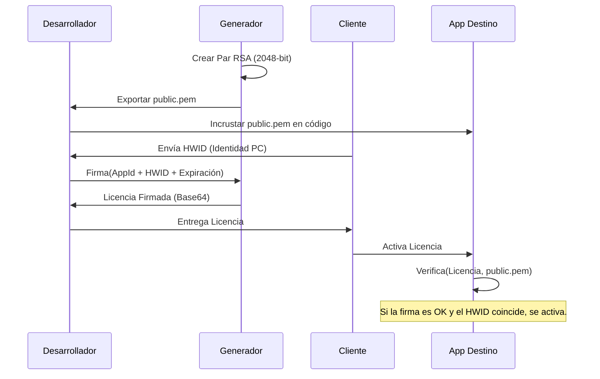

🇪🇸 **Español** | [🇺🇸 English](../../ARCHITECTURE.md) | [🇩🇪 Deutsch](../de/ARCHITECTURE.md) | [🇧🇷 Português](../pt/ARCHITECTURE.md)

# 🏗️ Arquitectura del Sistema: Ecosistema de Licencias

Este documento detalla el diseño técnico y los principios de seguridad que sustentan el License Generator.

---

## 🔒 El Modelo de Seguridad: RSA + SHA256

El sistema utiliza un esquema de **Confianza Unidireccional** basado en RSA. El desarrollador tiene el poder de "firmar" (Clave Privada) y las aplicaciones solo tienen el poder de "verificar" (Clave Pública).

### Flujo Criptográfico



---

## 🛠️ Fundamentos de Diseño

### 1. Estandarización PEM (PKCS#8)
A diferencia de los formatos XML antiguos de .NET, esta herramienta utiliza el estándar **PEM (Privacy-Enhanced Mail)**.
- **Interoperabilidad**: El formato Base64 delimitado por cabeceras `-----BEGIN...` es el estándar global. Cualquier lenguaje de programación (Python, Node.js, Java, Go, Rust, etc.) puede leer estas llaves directamente sin adaptadores ni conversiones.
- **Portabilidad**: Las licencias generadas son JSON firmado con RSA — un formato universal. Tu app cliente puede estar escrita en cualquier tecnología, no necesita ser .NET.
- **Seguridad**: Implementa PKCS#8 para la clave privada y SubjectPublicKeyInfo para la pública.
- **Algoritmo**: RSA 2048-bit + SHA256 + PKCS1v15 padding — el esquema de firma más soportado en toda la industria.

### 2. Vinculación de Hardware (HWID Binding)
La seguridad no se basa solo en la firma, sino en el **vínculo físico**. 
1. La aplicación cliente genera un identificador basado en componentes del PC (CPU, Placa Base, o MachineGuid de Windows).
2. El Generador incluye este ID dentro del paquete firmado de la licencia.
3. El validador en el cliente recrea el ID del hardware local y lo compara con el ID firmado.
4. **Resultado**: Si un usuario piratea el archivo de licencia y lo lleva a otro PC, el HWID no coincidirá y el validador la rechazará, aunque la firma criptográfica sea perfecta.

### 3. Integridad del Contrato (`GetDataToSign`)
Para evitar ataques de manipulación (como cambiar manualmente la fecha de expiración en el archivo JSON), el sistema firma un **bloque consolidado**.

`Firma = RSA_Sign(AppId | Nombre | HWID | Expiración)`

Si se cambia un solo bit en la licencia (ej: de 2024 a 2030), el cliente generará un bloque diferente y la firma dejará de ser válida.

---

## 📂 Organización de Datos

La aplicación sigue el patrón de **Almacenamiento Desacoplado**:
- **Binarios**: El código ejecutable puede vivir en cualquier sitio.
- **Almacén de Datos (`AppData/Local`)**: Contiene las llaves y el historial.

```text
LicenseGenerator/
├── Keys/
│   ├── App1/
│   │   ├── public.pem
│   │   └── private.pem
│   └── App2/
│       └── ...
└── History.json      (Registro de licencias emitidas)
```
---

## ⚖️ Modelo Legal y de Uso

A diferencia de muchas utilidades de seguridad, el **License Generator** no es un proyecto de código abierto sin restricciones.

1. **Propiedad Intelectual**: El diseño de los algoritmos de firma y la arquitectura del generador son propiedad del autor.
2. **Licencia EULA**: El software se rige por un Contrato de Licencia de Usuario Final ([LICENSE](../../LICENSE)) que permite su uso gratuito para gestionar licencias de tus aplicaciones (comerciales o no), pero prohíbe terminantemente la venta, redistribución o ingeniería inversa del propio Generador.
3. **Responsabilidad**: El autor no se hace responsable del uso que se le dé a las licencias generadas ni de la seguridad de las aplicaciones que las integren.

> [!IMPORTANT]
> Al utilizar esta herramienta, el desarrollador acepta que es responsable de la custodia de sus llaves privadas y de la correcta implementación del lado cliente.

---

> [!NOTE]
> Este diseño permite actualizar el generador sin tocar nunca tus llaves maestras ni perder el historial de tus clientes.
