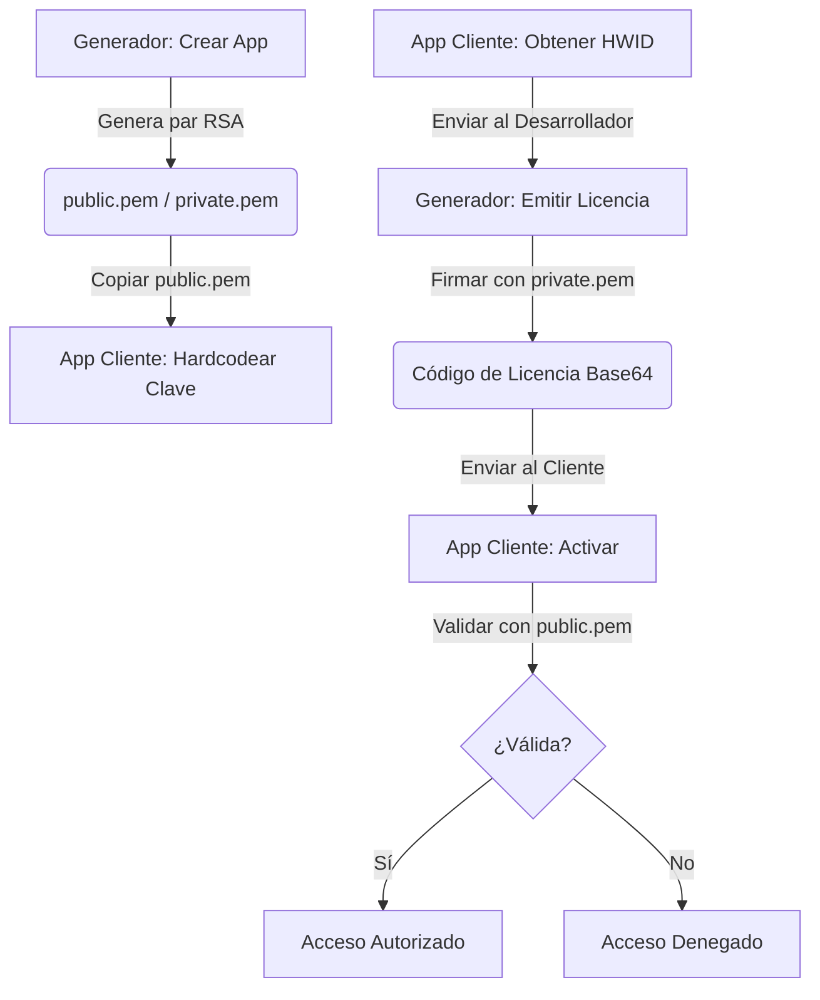

🇪🇸 **Español** | [🇺🇸 English](../../OPERATIONS.md) | [🇩🇪 Deutsch](../de/OPERATIONS.md)

# 📔 Guía de Operaciones e Integración de LicenseGenerator

Esta guía es el manual completo para operar el Generador y, sobre todo, para **integrar el sistema de licencias en tus propias aplicaciones** de forma profesional — sin importar el lenguaje de programación que uses.

> [!TIP]
> **La gran ventaja**: Este sistema está diseñado para desarrolladores que no quieren (o no pueden) mantener una infraestructura compleja de servidores. Te permite gestionar y vender licencias de **todas tus apps** de forma simple, organizada y totalmente offline. Sin bases de datos externas, sin APIs, sin costes de mantenimiento mensuales. Solo tú y tus llaves.

---

## 🔄 Visión General del Flujo

Para que un sistema de licencias funcione, el **Generador** (tu herramienta de administración) y el **Cliente** (la app del usuario final) deben estar sincronizados mediante criptografía RSA. Solo necesitan compartir **una cosa**: la clave pública.



**¿Por qué funciona?** Porque la clave privada (que solo tú tienes) firma los datos, y la clave pública (que incrustas en tu app) solo puede **verificar** esa firma, nunca crearla. Un pirata necesitaría tu clave privada para generar licencias falsas — y esa clave nunca sale de tu ordenador.

---

## 🛠 Fase 1: Preparación en el Generador

Antes de tocar una sola línea de código en tu aplicación, debes registrarla en el Generador. Esto le dice al sistema: "Voy a necesitar licencias para este producto."

1.  **Inicia el Generador**: Abre la aplicación `LicenseGenerator`.
2.  **Gestión de Apps**: Ve a la pestaña correspondiente y crea una nueva entrada con un **AppID** descriptivo (ej: `MiSuperApp`). Este nombre es importante — es el que vinculará las licencias a tu producto.
3.  **El Momento de la Exportación**: En cuanto pulses "Crear App", la herramienta hace lo siguiente automáticamente:
    -   Genera un par de llaves RSA de **2048 bits** únicas para esa App.
    -   **EXPORTA** los archivos PEM a la carpeta:
        `%LocalAppData%\LicenseGenerator\Keys\MiSuperApp\`
4.  **Localiza tu Clave Pública**: Abre el archivo `public.pem` que acaba de aparecer en esa carpeta. **Esta es la clave que tu app usará para verificar que las licencias son tuyas.** No la pierdas — aunque si la pierdes, siempre puedes volver a copiarla desde esa ruta.

> [!CAUTION]
> **Nunca distribuyas el archivo `private.pem`.** Es tu llave privada. Si alguien la obtiene, podrá generar licencias válidas para tu app. Trátala como una contraseña maestra.

---

## 📋 Gestión Centralizada por Aplicación

El **License Generator** actúa como tu panel de control centralizado para todos tus productos:

-   **Aislamiento**: Cada aplicación que registres funciona como un compartimento estanco. Tiene sus propias llaves RSA y su propio historial de licencias. Las llaves de `MiSuperApp` no tienen relación con las de `OtraApp`.
-   **Seguimiento**: En la pestaña **Historial**, puedes filtrar por aplicación para ver exactamente quién tiene una licencia activa, cuándo se emitió y cuándo expira.
-   **Soporte al cliente**: Si un usuario tiene problemas con su licencia, basta con buscar su nombre o HWID en el historial para reenviarle su código. Y si cambió de equipo (pérdida, robo, upgrade), simplemente generas una nueva licencia con su nuevo HWID — sin servidores intermedios, sin complicaciones y sin coste.
-   **Control de Estado**: Al ser un sistema offline, el "estado" de una licencia en el generador es un registro administrativo. La aplicación del cliente solo verifica la firma localmente — no necesita internet para comprobar que su licencia es válida.

---

## 💻 Fase 2: Integración en el Cliente

Esta es la parte crucial. Aquí es donde tu aplicación aprende a verificar licencias. El proceso es el mismo sin importar el lenguaje: necesitas 3 piezas fundamentales.

### Pieza 1: El Contrato de Datos (`LicenseData`)

Esta es la estructura que representa una licencia. **Tiene que ser idéntica en el Generador y en tu app.** Es el "contrato" entre ambos lados.

Lo más crítico es el método `GetDataToSign()`: genera la cadena exacta que se firmó. Si este método produce un resultado distinto al del Generador, **la firma siempre fallará**.

````tabs
```tab=C# (.NET 6+)
public class LicenseData
{
    public string AppId { get; set; } = string.Empty;
    public string RegistrationName { get; set; } = string.Empty;
    public string HardwareId { get; set; } = string.Empty;
    public DateTime? ExpirationDate { get; set; }
    public string Signature { get; set; } = string.Empty;

    // CRÍTICO: Este método debe ser IDÉNTICO en el Generador y en el Cliente
    public string GetDataToSign()
    {
        var dateStr = ExpirationDate?.ToString("yyyy-MM-dd") ?? "NEVER";
        return $"{AppId}|{RegistrationName}|{HardwareId}|{dateStr}";
    }
}
```
```tab=Python
import json
from dataclasses import dataclass, field
from datetime import datetime
from typing import Optional

@dataclass
class LicenseData:
    AppId: str = ""
    RegistrationName: str = ""
    HardwareId: str = ""
    ExpirationDate: Optional[str] = None  # formato "yyyy-MM-ddTHH:mm:ss"
    Signature: str = ""

    def get_data_to_sign(self) -> str:
        """CRÍTICO: Debe producir la misma cadena que el Generador C#"""
        if self.ExpirationDate:
            # Parsear la fecha ISO y extraer solo yyyy-MM-dd
            date_str = datetime.fromisoformat(self.ExpirationDate).strftime("%Y-%m-%d")
        else:
            date_str = "NEVER"
        return f"{self.AppId}|{self.RegistrationName}|{self.HardwareId}|{date_str}"
```
```tab=Node.js
class LicenseData {
    constructor(data = {}) {
        this.AppId = data.AppId || '';
        this.RegistrationName = data.RegistrationName || '';
        this.HardwareId = data.HardwareId || '';
        this.ExpirationDate = data.ExpirationDate || null;
        this.Signature = data.Signature || '';
    }

    // CRÍTICO: Debe producir la misma cadena que el Generador C#
    getDataToSign() {
        let dateStr = 'NEVER';
        if (this.ExpirationDate) {
            const d = new Date(this.ExpirationDate);
            dateStr = d.toISOString().split('T')[0]; // "yyyy-MM-dd"
        }
        return `${this.AppId}|${this.RegistrationName}|${this.HardwareId}|${dateStr}`;
    }
}
```
````

> [!IMPORTANT]
> **La regla de oro**: `GetDataToSign()` debe producir **exactamente** la cadena `AppId|Nombre|HWID|yyyy-MM-dd` (o `NEVER`). Un solo carácter de diferencia (un espacio, una mayúscula, un formato de fecha distinto) hará que la firma sea inválida. El separador siempre es `|`.

---

### Pieza 2: El Identificador de Hardware (HWID)

El HWID es lo que impide que un usuario copie su licencia a otro PC. La idea es simple: tu app genera un identificador único basado en el hardware del equipo, y ese identificador se incluye dentro de la firma. Si la licencia viaja a otro PC, el HWID no coincidirá.

**Puedes usar el método que quieras** para generar el HWID, pero debe cumplir dos reglas:
1.  **Determinista**: La misma máquina siempre genera el mismo ID.
2.  **Idéntico**: El formato que muestra tu app al usuario (para que lo envíe) debe ser exactamente el que después se usa para validar.

El Generador no impone ningún formato de HWID — simplemente firma lo que recibe. **Tú decides cómo generarlo.**

````tabs
```tab=C# (.NET — Windows + Linux)
public string GetMachineId()
{
    try
    {
        string id = string.Empty;

        if (RuntimeInformation.IsOSPlatform(OSPlatform.Windows))
        {
            // Windows: MachineGuid del registro (único por instalación de Windows)
            using var key = Registry.LocalMachine.OpenSubKey(@"SOFTWARE\Microsoft\Cryptography");
            id = key?.GetValue("MachineGuid")?.ToString() ?? string.Empty;
        }
        else if (RuntimeInformation.IsOSPlatform(OSPlatform.Linux))
        {
            // Linux: El archivo /etc/machine-id es estándar en systemd
            if (File.Exists("/etc/machine-id"))
                id = File.ReadAllText("/etc/machine-id").Trim();
            else if (File.Exists("/var/lib/dbus/machine-id"))
                id = File.ReadAllText("/var/lib/dbus/machine-id").Trim();
        }
        else if (RuntimeInformation.IsOSPlatform(OSPlatform.OSX))
        {
            // macOS: IOPlatformSerialNumber via ioreg
            var p = Process.Start(new ProcessStartInfo("ioreg", "-rd1 -c IOPlatformExpertDevice")
                { RedirectStandardOutput = true, UseShellExecute = false });
            var output = p?.StandardOutput.ReadToEnd() ?? "";
            var match = Regex.Match(output, "\"IOPlatformSerialNumber\" = \"(.+?)\"");
            if (match.Success) id = match.Groups[1].Value;
        }

        if (string.IsNullOrEmpty(id)) return "GENERIC-HWID";

        // Formato amigable: primeros 8 caracteres, mayúsculas
        return id.Replace("-", "").Substring(0, 8).ToUpper();
    }
    catch { return "UNKNOWN-HWID"; }
}
```
```tab=Python
import platform, subprocess, re, uuid

def get_machine_id() -> str:
    """Obtiene un HWID de 8 caracteres del equipo actual."""
    system = platform.system()
    raw_id = ""

    if system == "Windows":
        import winreg
        key = winreg.OpenKey(winreg.HKEY_LOCAL_MACHINE, r"SOFTWARE\Microsoft\Cryptography")
        raw_id = winreg.QueryValueEx(key, "MachineGuid")[0]
    elif system == "Linux":
        for path in ["/etc/machine-id", "/var/lib/dbus/machine-id"]:
            try:
                raw_id = open(path).read().strip()
                break
            except FileNotFoundError:
                continue
    elif system == "Darwin":  # macOS
        out = subprocess.check_output(["ioreg", "-rd1", "-c", "IOPlatformExpertDevice"]).decode()
        match = re.search(r'"IOPlatformSerialNumber" = "(.+?)"', out)
        if match:
            raw_id = match.group(1)

    if not raw_id:
        raw_id = str(uuid.getnode())  # Fallback: MAC address

    return raw_id.replace("-", "")[:8].upper()
```
```tab=Node.js
const os = require('os');
const crypto = require('crypto');
const { execSync } = require('child_process');

function getMachineId() {
    let rawId = '';

    if (process.platform === 'win32') {
        // Windows: lee MachineGuid del registro
        const output = execSync(
            'reg query HKLM\\SOFTWARE\\Microsoft\\Cryptography /v MachineGuid'
        ).toString();
        const match = output.match(/MachineGuid\s+REG_SZ\s+(.+)/);
        if (match) rawId = match[1].trim();
    } else if (process.platform === 'linux') {
        const fs = require('fs');
        for (const p of ['/etc/machine-id', '/var/lib/dbus/machine-id']) {
            try { rawId = fs.readFileSync(p, 'utf-8').trim(); break; } catch {}
        }
    } else if (process.platform === 'darwin') {
        const out = execSync('ioreg -rd1 -c IOPlatformExpertDevice').toString();
        const match = out.match(/"IOPlatformSerialNumber" = "(.+?)"/);
        if (match) rawId = match[1];
    }

    if (!rawId) rawId = os.hostname(); // Fallback
    return rawId.replace(/-/g, '').substring(0, 8).toUpperCase();
}
```
````

> [!NOTE]
> **¿Por qué 8 caracteres?** Solo por usabilidad. Un GUID completo como `a8c3f1e2-b456-7890-cdef-1234567890ab` es difícil de dictar por teléfono o teclear. Los primeros 8 caracteres (`A8C3F1E2`) son suficientes para diferenciar millones de equipos y el usuario puede copiarlos fácilmente.

---

### Pieza 3: El Servicio de Licencias (Completo)

Aquí es donde todo se une. Este es el servicio completo que necesita tu app, con las 4 funciones esenciales:

1.  **`GetMachineId()`** — Para mostrar al usuario su HWID y que te lo envíe.
2.  **`Activate(code)`** — Para decodificar y validar el Base64 que le entregas al cliente.
3.  **`IsLicensed()`** — Para comprobar rápidamente si hay una licencia activa (se llama al arrancar la app).
4.  **`Validate(license)`** — La verificación criptográfica RSA en sí.

````tabs
```tab=C# (.NET 6+) — Implementación completa
using System.Security.Cryptography;
using System.Text;
using System.Text.Json;

public interface ILicenseService
{
    bool IsLicensed();
    bool Activate(string licenseKey);
    LicenseData? GetCurrentLicense();
    string GetMachineId();
}

public class LicenseService : ILicenseService
{
    private const string AppId = "MiSuperApp";     // Debe coincidir con el ID en el Generador
    private const string LicenseFileName = "license.lic";

    // PEGADO DESDE EL ARCHIVO public.pem QUE EXPORTÓ EL GENERADOR
    private const string PublicKeyPem = @"-----BEGIN PUBLIC KEY-----
AQUI_VA_TU_CLAVE_PUBLICA_COMPLETA
CON_SUS_CABECERAS_Y_TODO
-----END PUBLIC KEY-----";

    private LicenseData? _cachedLicense;

    // ══════════════════════════════════════════════════════════════
    // 1. COMPROBAR: ¿Hay licencia válida? (Llamar al arrancar)
    // ══════════════════════════════════════════════════════════════
    public bool IsLicensed()
    {
        if (_cachedLicense != null) return true;

        // Intentar cargar del disco (por si ya se activó antes)
        var license = LoadFromFile();
        if (license != null && Validate(license))
        {
            _cachedLicense = license;
            return true;
        }
        return false;
    }

    // ══════════════════════════════════════════════════════════════
    // 2. ACTIVAR: El usuario pega el código Base64 que le enviaste
    // ══════════════════════════════════════════════════════════════
    public bool Activate(string licenseKey)
    {
        try
        {
            // El Generador produce: Base64 → que dentro tiene JSON → que dentro tiene los datos
            var json = Encoding.UTF8.GetString(Convert.FromBase64String(licenseKey));
            var license = JsonSerializer.Deserialize<LicenseData>(json);

            if (license != null && Validate(license))
            {
                SaveToFile(licenseKey);       // Persistir para próximos arranques
                _cachedLicense = license;
                return true;
            }
        }
        catch { /* Formato inválido — el código está corrupto o mal copiado */ }
        return false;
    }

    public LicenseData? GetCurrentLicense() => _cachedLicense;

    // ══════════════════════════════════════════════════════════════
    // 3. VALIDAR: Verificación criptográfica RSA
    // ══════════════════════════════════════════════════════════════
    private bool Validate(LicenseData license)
    {
        // ¿Es para esta app?
        if (license.AppId != AppId) return false;

        // ¿Coincide el hardware?
        if (license.HardwareId != GetMachineId()) return false;

        // ¿Ha expirado?
        if (license.ExpirationDate.HasValue && license.ExpirationDate < DateTime.Now) return false;

        try
        {
            // La firma RSA: importar la clave pública y verificar
            using var rsa = RSA.Create();
            rsa.ImportFromPem(PublicKeyPem);

            var data = Encoding.UTF8.GetBytes(license.GetDataToSign());
            var signature = Convert.FromBase64String(license.Signature);

            return rsa.VerifyData(data, signature, HashAlgorithmName.SHA256, RSASignaturePadding.Pkcs1);
        }
        catch { return false; }
    }

    // ══════════════════════════════════════════════════════════════
    // 4. HWID: Identidad única del PC (ver sección anterior)
    // ══════════════════════════════════════════════════════════════
    public string GetMachineId()
    {
        // ... (usar la implementación de la sección anterior)
    }

    // ══════════════════════════════════════════════════════════════
    // Persistencia: Guardar/Cargar del disco
    // ══════════════════════════════════════════════════════════════
    private void SaveToFile(string licenseKey)
    {
        File.WriteAllText(GetLicensePath(), licenseKey);
    }

    private LicenseData? LoadFromFile()
    {
        var path = GetLicensePath();
        if (!File.Exists(path)) return null;
        try
        {
            var key = File.ReadAllText(path);
            var json = Encoding.UTF8.GetString(Convert.FromBase64String(key));
            return JsonSerializer.Deserialize<LicenseData>(json);
        }
        catch { return null; }
    }

    private string GetLicensePath()
    {
        var dir = Path.Combine(
            Environment.GetFolderPath(Environment.SpecialFolder.LocalApplicationData),
            AppId  // Cada app guarda su licencia en su propia carpeta
        );
        if (!Directory.Exists(dir)) Directory.CreateDirectory(dir);
        return Path.Combine(dir, LicenseFileName);
    }
}
```
```tab=Python — Implementación completa
import base64, json, os, platform
from cryptography.hazmat.primitives import hashes, serialization
from cryptography.hazmat.primitives.asymmetric import padding, utils

# pip install cryptography

APP_ID = "MiSuperApp"
LICENSE_FILE = "license.lic"

# PEGADO DESDE EL ARCHIVO public.pem QUE EXPORTÓ EL GENERADOR
PUBLIC_KEY_PEM = """-----BEGIN PUBLIC KEY-----
AQUI_VA_TU_CLAVE_PUBLICA_COMPLETA
CON_SUS_CABECERAS_Y_TODO
-----END PUBLIC KEY-----"""

_cached_license = None

def get_license_path() -> str:
    """Ruta donde se guarda la licencia activada."""
    if platform.system() == "Windows":
        base = os.environ.get("LOCALAPPDATA", os.path.expanduser("~"))
    else:
        base = os.path.expanduser("~/.local/share")
    directory = os.path.join(base, APP_ID)
    os.makedirs(directory, exist_ok=True)
    return os.path.join(directory, LICENSE_FILE)

def validate(license: 'LicenseData') -> bool:
    """Verificación criptográfica RSA completa."""
    if license.AppId != APP_ID:
        return False
    if license.HardwareId != get_machine_id():
        return False
    if license.ExpirationDate:
        from datetime import datetime
        exp = datetime.fromisoformat(license.ExpirationDate)
        if exp < datetime.now():
            return False
    try:
        public_key = serialization.load_pem_public_key(PUBLIC_KEY_PEM.encode())
        data = license.get_data_to_sign().encode("utf-8")
        signature = base64.b64decode(license.Signature)
        public_key.verify(
            signature,
            data,
            padding.PKCS1v15(),
            hashes.SHA256()
        )
        return True
    except Exception:
        return False

def activate(license_key: str) -> bool:
    """Decodifica el Base64 del Generador, valida, y persiste."""
    global _cached_license
    try:
        json_str = base64.b64decode(license_key).decode("utf-8")
        data = json.loads(json_str)
        license = LicenseData(**data)
        if validate(license):
            with open(get_license_path(), "w") as f:
                f.write(license_key)
            _cached_license = license
            return True
    except Exception:
        pass
    return False

def is_licensed() -> bool:
    """Comprueba si hay una licencia válida (al arrancar la app)."""
    global _cached_license
    if _cached_license:
        return True
    path = get_license_path()
    if not os.path.exists(path):
        return False
    try:
        key = open(path).read()
        json_str = base64.b64decode(key).decode("utf-8")
        data = json.loads(json_str)
        license = LicenseData(**data)
        if validate(license):
            _cached_license = license
            return True
    except Exception:
        pass
    return False
```
```tab=Node.js — Implementación completa
const crypto = require('crypto');
const fs = require('fs');
const path = require('path');
const os = require('os');

const APP_ID = 'MiSuperApp';
const LICENSE_FILE = 'license.lic';

// PEGADO DESDE EL ARCHIVO public.pem QUE EXPORTÓ EL GENERADOR
const PUBLIC_KEY_PEM = `-----BEGIN PUBLIC KEY-----
AQUI_VA_TU_CLAVE_PUBLICA_COMPLETA
CON_SUS_CABECERAS_Y_TODO
-----END PUBLIC KEY-----`;

let cachedLicense = null;

function getLicensePath() {
    const base = process.platform === 'win32'
        ? process.env.LOCALAPPDATA || os.homedir()
        : path.join(os.homedir(), '.local', 'share');
    const dir = path.join(base, APP_ID);
    if (!fs.existsSync(dir)) fs.mkdirSync(dir, { recursive: true });
    return path.join(dir, LICENSE_FILE);
}

function validate(license) {
    if (license.AppId !== APP_ID) return false;
    if (license.HardwareId !== getMachineId()) return false;
    if (license.ExpirationDate && new Date(license.ExpirationDate) < new Date()) return false;
    try {
        const data = Buffer.from(license.getDataToSign(), 'utf-8');
        const signature = Buffer.from(license.Signature, 'base64');
        const verify = crypto.createVerify('SHA256');
        verify.update(data);
        return verify.verify(PUBLIC_KEY_PEM, signature);
    } catch { return false; }
}

function activate(licenseKey) {
    try {
        const json = Buffer.from(licenseKey, 'base64').toString('utf-8');
        const data = JSON.parse(json);
        const license = new LicenseData(data);
        if (validate(license)) {
            fs.writeFileSync(getLicensePath(), licenseKey);
            cachedLicense = license;
            return true;
        }
    } catch {}
    return false;
}

function isLicensed() {
    if (cachedLicense) return true;
    const licensePath = getLicensePath();
    if (!fs.existsSync(licensePath)) return false;
    try {
        const key = fs.readFileSync(licensePath, 'utf-8');
        const json = Buffer.from(key, 'base64').toString('utf-8');
        const data = JSON.parse(json);
        const license = new LicenseData(data);
        if (validate(license)) {
            cachedLicense = license;
            return true;
        }
    } catch {}
    return false;
}
```
````

**¿Qué hace cada parte, paso a paso?**

1.  El Generador produce un JSON con `AppId`, `RegistrationName`, `HardwareId`, `ExpirationDate` y `Signature`, todo codificado en **Base64**. Ese bloque Base64 es lo que le envías al cliente.
2.  El cliente **decodifica** el Base64 → obtiene el JSON → lo deserializa a `LicenseData`.
3.  El validador **reconstruye** la cadena `GetDataToSign()` y usa la clave pública para verificar que esa cadena fue firmada por tu clave privada.
4.  Si pasa, se guarda un archivo `license.lic` en el AppData del usuario para no tener que volver a activar cada vez que abra la app.

---

## 🎨 Fase 3: Pantalla de Activación en tu App

Tu app necesita una pantalla donde el usuario pueda:
- **Ver su HWID** (para enviártelo).
- **Pegar el código de licencia** que tú le enviaste.
- **Activar** y ver el resultado.

No importa si tu interfaz es de consola, web o escritorio. El concepto es el mismo:

```
┌──────────────────────────────────────────────┐
│           🔑 Activación de Licencia          │
│                                              │
│  Tu ID de equipo: [ A8C3F1E2 ]  [📋 Copiar] │
│                                              │
│  Código de licencia:                         │
│  ┌──────────────────────────────────────┐    │
│  │ (El usuario pega el Base64 aquí)     │    │
│  └──────────────────────────────────────┘    │
│                                              │
│               [ ✅ Activar ]                 │
│                                              │
│  Estado: ❌ Sin licencia                     │
└──────────────────────────────────────────────┘
```

**El flujo del usuario final es:**
1.  Abre tu app → ve la pantalla de activación.
2.  Copia su HWID y te lo envía (por email, formulario web, etc.).
3.  Tú abres el Generador → seleccionas su app → pegas el HWID → pulsas Generar.
4.  Le envías el código Base64 resultante.
5.  El cliente lo pega en su app → pulsa Activar → listo.

---

## 🎫 Fase 4: Emisión de Licencias (Tu Día a Día)

Cuando un cliente quiera comprar tu app, el proceso es rápido:

1.  **Pídele su HWID**: Tu app cliente ya tiene el botón para "Copiar ID de este equipo".
2.  **Abre el Generador**: Selecciona la App correspondiente.
3.  **Rellena los datos**:
    -   **Cliente**: Nombre del comprador (para tu registro).
    -   **HWID**: El código de 8 caracteres que te envió.
    -   **Expiración**: Elige una fecha o déjalo vacío para licencia permanente.
4.  **Genera**: Pulsa el botón y obtendrás un bloque Base64 largo.
5.  **Envía**: Copia ese bloque y envíaselo al cliente por el medio que prefieras.

> [!NOTE]
> Cada licencia generada queda registrada automáticamente en el **Historial** del Generador. Puedes consultarlo en cualquier momento para ver cuántas licencias has emitido, a quién, y cuándo expiran.

---

## 🚫 Irreversibilidad y Revocación

> [!CAUTION]
> **La Firma es Permanente**: Debido a que este sistema utiliza criptografía asimétrica offline, una licencia firmada es técnicamente válida para siempre (o hasta su fecha de expiración) en el PC del cliente, sin necesidad de internet.

**¿Puedo revocar una licencia que ya entregué?**

-   **De forma remota: NO.** Al no haber un servidor central que el cliente consulte en cada arranque, no puedes "apagar" una licencia a distancia.
-   **Con una blacklist: SÍ.** Puedes implementar una "Lista Negra" en la próxima actualización de tu app. Si incluyes una lista de firmas revocadas en tu código, la validación puede rechazar esas licencias aunque la firma RSA sea correcta.
-   **Por versión mayor: SÍ.** Si cambias la **Clave Pública** en una versión nueva (ej: de V1 a V2), todas las licencias anteriores dejarán de funcionar para esa versión. Esto es útil para cobrar por upgrades mayores.

---

## 🌍 Compatibilidad de Stacks Tecnológicos

Este sistema **NO** está limitado a .NET / C#. El Generador usa estándares criptográficos industriales que cualquier lenguaje soporta:

| Componente | Estándar Usado | ¿Universal? |
|:---|:---|:---|
| Llaves RSA | **PEM (PKCS#8 / SubjectPublicKeyInfo)** | ✅ Sí — formato global |
| Algoritmo de firma | **RSA + SHA256 + PKCS1v15** | ✅ Sí — disponible en toda librería cripto |
| Formato de licencia | **JSON codificado en Base64** | ✅ Sí — no depende de .NET |
| Formato de firma | **Base64** | ✅ Sí — universal |

**Puedes validar licencias en cualquier stack:**

| Lenguaje/Stack | Librería RSA/PEM | Dificultad |
|:---|:---|:---|
| **C# / .NET 6+** | `System.Security.Cryptography` (nativo) | ⭐ Trivial |
| **Python** | `cryptography` (pip install) | ⭐ Trivial |
| **Node.js** | `crypto` (módulo nativo) | ⭐ Trivial |
| **Java / Kotlin** | `java.security` (nativo) | ⭐⭐ Fácil (necesita KeyFactory) |
| **Rust** | `rsa` + `pem` crates | ⭐⭐ Fácil |
| **Go** | `crypto/rsa` (stdlib) | ⭐⭐ Fácil |
| **Swift** | `Security` framework | ⭐⭐ Fácil |
| **Electron / Web** | Node.js `crypto` o Web Crypto API | ⭐⭐ Fácil |

> [!TIP]
> **El Generador es una herramienta de administración.** Él vive en tu PC como app de escritorio (.NET). Pero las licencias que produce son **archivos JSON firmados con RSA** — un formato que cualquier programa en cualquier lenguaje puede leer y verificar. Tu app cliente puede estar hecha en Python, Java, React, Electron, Flutter, o lo que sea.

---

## ⚠️ Resolución de Problemas Comunes

| Problema | Causa Probable | Solución |
| :--- | :--- | :--- |
| **"Error de Firma"** | La clave pública no coincide con la privada usada para firmar, o `GetDataToSign()` produce una cadena distinta. | Re-copia el contenido completo de `public.pem` (con cabeceras `BEGIN/END`). Verifica que los separadores `\|` son correctos. |
| **"Licencia no válida en este PC"** | El HWID generado en el PC del cliente es distinto al que introdujiste al firmar. | Asegúrate de que tu app usa el **mismo algoritmo exacto** de HWID que el Generador recibió. Cuidado con mayúsculas/minúsculas. |
| **"Licencia expirada"** | La fecha del PC del cliente es posterior a `ExpirationDate`. | Genera una nueva licencia con fecha extendida. |
| **"Error al importar PEM"** (C#) | Falta `System.Security.Cryptography` o usas .NET inferior a 6. | Actualiza a .NET 6+ que incluye `ImportFromPem()` nativo. |
| **"Error al importar PEM"** (Python) | No tienes instalada la librería `cryptography`. | Ejecuta `pip install cryptography`. |
| **La licencia funciona en desarrollo pero no en producción** | La app publicada usa un HWID distinto (ej: un contenedor Docker tiene otro `machine-id`). | Verifica que el entorno de producción permite acceder a los mismos datos de hardware. |
