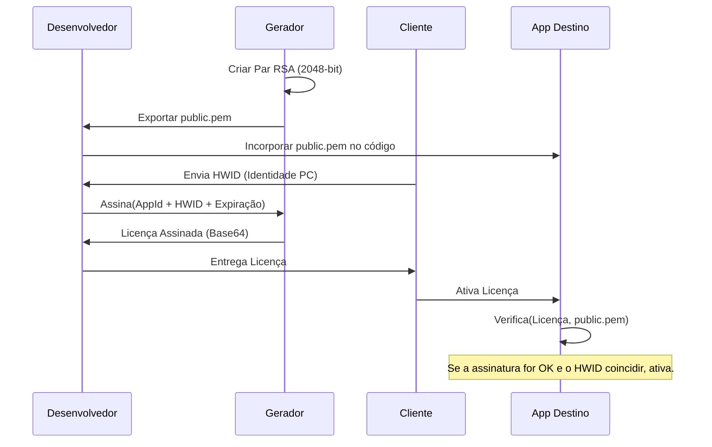

[🇪🇸 Español](../es/ARCHITECTURE.md) | [🇺🇸 English](../../ARCHITECTURE.md) | [🇩🇪 Deutsch](../de/ARCHITECTURE.md) | 🇧🇷 **Português** | [🇨🇳 中文](../zh/README.md)

# 🏗️ Arquitetura do Sistema: Ecossistema de Licenças

Este documento detalha o design técnico e os princípios de segurança que sustentam o License Generator.

---

## 🔒 O Modelo de Segurança: RSA + SHA256

O sistema utiliza um esquema de **Confiança Unidirecional** baseado em RSA. O desenvolvedor tem o poder de "assinar" (Chave Privada) e os aplicativos apenas têm o poder de "verificar" (Chave Pública).

### Fluxo Criptográfico



---

## 🛠️ Fundamentos de Design

### 1. Padronização PEM (PKCS#8)
Diferente dos formatos XML antigos do .NET, esta ferramenta utiliza o padrão **PEM (Privacy-Enhanced Mail)**.
- **Interoperabilidade**: O formato Base64 delimitado por cabeçalhos `-----BEGIN...` é o padrão global. Qualquer linguagem de programação (Python, Node.js, Java, Go, Rust, etc.) pode ler essas chaves diretamente sem adaptadores ou conversões.
- **Portabilidade**: As licenças geradas são JSON assinado com RSA — um formato universal. Seu app cliente pode ser escrito em qualquer tecnologia, não precisa ser .NET.
- **Segurança**: Implementa PKCS#8 para a chave privada e SubjectPublicKeyInfo para a pública.
- **Algoritmo**: RSA 2048-bit + SHA256 + preenchimento PKCS1v15 — o esquema de assinatura mais suportado em toda a indústria.

### 2. Vínculo de Hardware (HWID)
A segurança não se baseia apenas na assinatura, mas no **vínculo físico**.
1. O aplicativo cliente gera um identificador baseado em componentes do PC (CPU, Placa Mãe ou MachineGuid do Windows).
2. O Gerador inclui este ID dentro do pacote assinado da licença.
3. O validador no cliente recria o ID do hardware local e o compara com o ID assinado.
4. **Resultado**: Se um usuário pirateia o arquivo de licença e o leva para outro PC, o HWID não coincidirá e o validador a rejeitará, mesmo que a assinatura criptográfica seja perfeita.

### 3. Integridade do Contrato (`GetDataToSign`)
Para evitar ataques de manipulação (como alterar manualmente a data de expiração no arquivo JSON), o sistema assina um **bloco consolidado**.

`Assinatura = RSA_Sign(AppId | Nome | HWID | Expiração)`

Se um único bit for alterado na licença (ex: de 2024 para 2030), o cliente gerará um bloco diferente e a assinatura deixará de ser válida.

---

## 📂 Organização de Dados

O aplicativo segue o padrão de **Armazenamento Desacoplado**:
- **Binários**: O código executável pode viver em qualquer lugar.
- **Armazenamento de Dados (`AppData/Local`)**: Contém as chaves e o histórico.

```text
LicenseGenerator/
├── Keys/
│   ├── App1/
│   │   ├── public.pem
│   │   └── private.pem
│   └── App2/
│       └── ...
└── History.json      (Registro de licenças emitidas)
```
---

## ⚖️ Modelo Legal e de Uso

Diferente de muitas utilidades de segurança, o **License Generator** não é um projeto de código aberto sem restrições.

1. **Propriedade Intelectual**: O design dos algoritmos de assinatura e a arquitetura do gerador são propriedade do autor.
2. **Licença EULA**: O software é regido por um Contrato de Licença de Usuário Final ([LICENSE](../../LICENSE)) que permite o uso gratuito para gerenciar licenças de seus aplicativos (comerciais ou não), mas proíbe terminantemente a venda, redistribuição ou engenharia reversa do próprio Gerador.
3. **Responsabilidade**: O autor não se responsabiliza pelo uso dado às licenças geradas nem pela segurança dos aplicativos que as integrem.

> [!IMPORTANT]
> Ao utilizar esta ferramenta, o desenvolvedor aceita que é responsável pela custódia de suas chaves privadas e pela correta implementação do lado do cliente.

---

> [!NOTE]
> Este design permite atualizar o gerador sem nunca tocar em suas chaves mestras nem perder o histórico de seus clientes.
