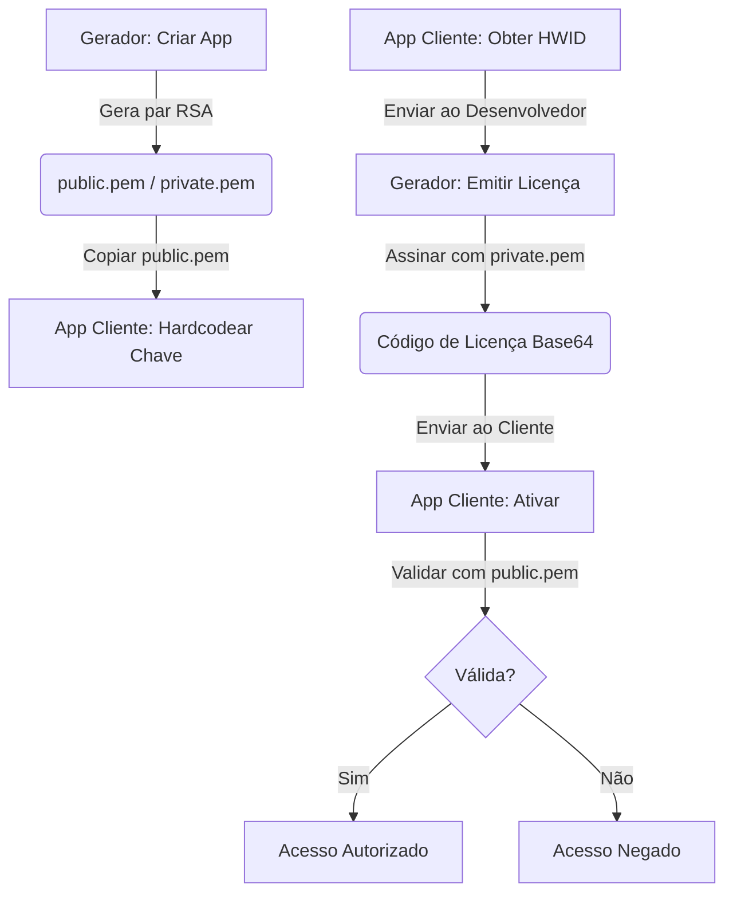

# 📔 Guia de Operações e Integração do LicenseGenerator

[🇪🇸 Español](../es/OPERATIONS.md) | [🇺🇸 English](../../OPERATIONS.md) | [🇩🇪 Deutsch](../de/OPERATIONS.md) | 🇧🇷 **Português** | [🇨🇳 中文](../zh/README.md)

Este guia é o manual completo para operar o Gerador e, acima de tudo, para **integrar o sistema de licenças em seus próprios aplicativos** de forma profissional — sem importar a linguagem de programação que você usa.

> [!TIP]
> **A Grande Vantagem**: Este sistema foi projetado para desenvolvedores que não querem (ou não podem) manter uma infraestrutura complexa de servidores. Ele permite que você gerencie e venda licenças de **todos os seus apps** de forma simples, organizada e totalmente offline. Sem bancos de dados externos, sem APIs, sem custos mensais de manutenção. Apenas você e suas chaves.

---

## 🔄 Visão Geral do Fluxo

Para que um sistema de licenças funcione, o **Gerador** (sua ferramenta de administração) e o **Cliente** (o app do usuário final) devem estar sincronizados via criptografia RSA. Eles só precisam compartilhar **uma coisa**: a chave pública.



**Por que funciona?** Porque a chave privada (que só você tem) assina os dados, e a chave pública (que você incorpora no seu app) só pode **verificar** essa assinatura, nunca criá-la. Um pirata precisaria da sua chave privada para gerar licenças válidas para o seu app — e essa chave nunca sai do seu computador.

---

## 🛠 Fase 1: Preparação no Gerador

Antes de tocar em uma única linha de código no seu aplicativo, você deve registrá-lo no Gerador. Isso diz ao sistema: "Vou precisar de licenças para este produto."

1.  **Inicie o Gerador**: Abra o aplicativo `LicenseGenerator`.
2.  **Gerenciamento de Apps**: Vá para a aba correspondente e crie uma nova entrada com um **AppID** descritivo (ex: `MeuSuperApp`). Este nome é importante — é o que vinculará as licenças ao seu produto.
3.  **O Momento da Exportação**: Assim que você clicar em "Criar App", a ferramenta faz o seguinte automaticamente:
    -   Gera um par de chaves RSA de **2048 bits** únicas para esse App.
    -   **EXPORTA** os arquivos PEM para a pasta:
        `%LocalAppData%\LicenseGenerator\Keys\MeuSuperApp\`
4.  **Localize sua Chave Pública**: Abra o arquivo `public.pem` que acabou de aparecer nessa pasta. **Esta é a chave que seu app usará para verificar que as licenças são suas.** Não a perca — embora, se perder, você possa sempre copiá-la novamente desse caminho.

> [!CAUTION]
> **Nunca distribua o arquivo `private.pem`.** É sua chave privada. Se alguém obtiver, poderá gerar licenças válidas para o seu app. Trate-a como uma senha mestra.

---

## 📋 Gerenciamento Centralizado por Aplicativo

O **License Generator** atua como seu painel de controle centralizado para todos os seus produtos:

-   **Isolamento**: Cada aplicativo que você registra funciona como um compartimento estanque. Ele tem suas próprias chaves RSA e seu próprio histórico de licenças. As chaves de `MeuSuperApp` não têm relação com as de `OutroApp`.
-   **Rastreamento**: Na aba **Histórico**, você pode filtrar por aplicativo para ver exatamente quem tem uma licença ativa, quando foi emitida e quando expira.
-   **Suporte ao cliente**: Se um usuário tiver problemas com sua licença, basta buscar seu nome ou HWID no histórico para reenviar seu código. E se ele trocou de computador (perda, roubo, upgrade), basta gerar uma nova licença com seu novo HWID — sem servidores intermediários, sem complicações e sem custo.
-   **Controle de Estado**: Sendo um sistema offline, o "estado" de uma licença no gerador é um registro administrativo. O aplicativo cliente apenas verifica a assinatura localmente — não precisa de internet para verificar se sua licença é válida.

---

## 💻 Fase 2: Integração no Cliente

Esta é a parte crucial. É aqui que seu aplicativo aprende a verificar licenças. O processo é o mesmo independente da linguagem: você precisa de 3 peças fundamentais.

### Peça 1: O Contrato de Dados (`LicenseData`)

Esta é a estrutura que representa uma licença. **Deve ser idêntica no Gerador e no seu app.** É o "contrato" entre ambos os lados.

O mais crítico é o método `GetDataToSign()`: ele gera a string exata que foi assinada. Se este método produzir um resultado diferente do Gerador, **a assinatura sempre falhará**.

````tabs
```tab=C# (.NET 6+)
public class LicenseData
{
    public string AppId { get; set; } = string.Empty;
    public string RegistrationName { get; set; } = string.Empty;
    public string HardwareId { get; set; } = string.Empty;
    public DateTime? ExpirationDate { get; set; }
    public string Signature { get; set; } = string.Empty;

    // CRÍTICO: Este método deve ser IDÊNTICO no Gerador e no Cliente
    public string GetDataToSign()
    {
        var dateStr = ExpirationDate?.ToString("yyyy-MM-dd") ?? "NEVER";
        return $"{AppId}|{RegistrationName}|{HardwareId}|{dateStr}";
    }
}
```
```tab=Python
import json
from dataclasses import dataclass, field
from datetime import datetime
from typing import Optional

@dataclass
class LicenseData:
    AppId: str = ""
    RegistrationName: str = ""
    HardwareId: str = ""
    ExpirationDate: Optional[str] = None  # formato "yyyy-MM-ddTHH:mm:ss"
    Signature: str = ""

    def get_data_to_sign(self) -> str:
        """CRÍTICO: Deve produzir a mesma string que o Gerador C#"""
        if self.ExpirationDate:
            # Parsear a data ISO e extrair apenas yyyy-MM-dd
            date_str = datetime.fromisoformat(self.ExpirationDate).strftime("%Y-%m-%d")
        else:
            date_str = "NEVER"
        return f"{self.AppId}|{self.RegistrationName}|{self.HardwareId}|{date_str}"
```
```tab=Node.js
class LicenseData {
    constructor(data = {}) {
        this.AppId = data.AppId || '';
        this.RegistrationName = data.RegistrationName || '';
        this.HardwareId = data.HardwareId || '';
        this.ExpirationDate = data.ExpirationDate || null;
        this.Signature = data.Signature || '';
    }

    // CRÍTICO: Deve produzir a mesma string que o Gerador C#
    getDataToSign() {
        let dateStr = 'NEVER';
        if (this.ExpirationDate) {
            const d = new Date(this.ExpirationDate);
            dateStr = d.toISOString().split('T')[0]; // "yyyy-MM-dd"
        }
        return `${this.AppId}|${this.RegistrationName}|${this.HardwareId}|${dateStr}`;
    }
}
```
````

> [!IMPORTANT]
> **A Regra de Ouro**: `GetDataToSign()` deve produzir **exatamente** a string `AppId|Nome|HWID|yyyy-MM-dd` (ou `NEVER`). Um único caractere de diferença (um espaço, uma maiúscula, um formato de data diferente) tornará a assinatura inválida. O separador é sempre `|`.

---

### Peça 2: O Identificador de Hardware (HWID)

O HWID é o que impede que um usuário copie sua licença para outro PC. A ideia é simples: seu app gera um identificador único baseado no hardware do computador, e esse identificador é incluído dentro da assinatura. Se a licença viaja para outro PC, o HWID não coincidirá.

**Você pode usar o método que quiser** para gerar o HWID, mas ele deve seguir duas regras:
1.  **Determinístico**: A mesma máquina sempre gera o mesmo ID.
2.  **Idêntico**: O formato que seu app mostra ao usuário (para enviar a você) deve ser exatamente o que depois é usado para validar.

O Gerador não impõe nenhum formato de HWID — ele simplesmente assina o que recebe. **Você decide como gerá-lo.**

````tabs
```tab=C# (.NET — Windows + Linux)
public string GetMachineId()
{
    try
    {
        string id = string.Empty;

        if (RuntimeInformation.IsOSPlatform(OSPlatform.Windows))
        {
            // Windows: MachineGuid do registro (único por instalação do Windows)
            using var key = Registry.LocalMachine.OpenSubKey(@"SOFTWARE\Microsoft\Cryptography");
            id = key?.GetValue("MachineGuid")?.ToString() ?? string.Empty;
        }
        else if (RuntimeInformation.IsOSPlatform(OSPlatform.Linux))
        {
            // Linux: O arquivo /etc/machine-id é padrão no systemd
            if (File.Exists("/etc/machine-id"))
                id = File.ReadAllText("/etc/machine-id").Trim();
            else if (File.Exists("/var/lib/dbus/machine-id"))
                id = File.ReadAllText("/var/lib/dbus/machine-id").Trim();
        }
        else if (RuntimeInformation.IsOSPlatform(OSPlatform.OSX))
        {
            // macOS: IOPlatformSerialNumber via ioreg
            var p = Process.Start(new ProcessStartInfo("ioreg", "-rd1 -c IOPlatformExpertDevice")
                { RedirectStandardOutput = true, UseShellExecute = false });
            var output = p?.StandardOutput.ReadToEnd() ?? "";
            var match = Regex.Match(output, "\"IOPlatformSerialNumber\" = \"(.+?)\"");
            if (match.Success) id = match.Groups[1].Value;
        }

        if (string.IsNullOrEmpty(id)) return "GENERIC-HWID";

        // Formato amigável: primeiros 8 caracteres, maiúsculas
        return id.Replace("-", "").Substring(0, 8).ToUpper();
    }
    catch { return "UNKNOWN-HWID"; }
}
```
```tab=Python
import platform, subprocess, re, uuid

def get_machine_id() -> str:
    """Obtém um HWID de 8 caracteres do computador atual."""
    system = platform.system()
    raw_id = ""

    if system == "Windows":
        import winreg
        key = winreg.OpenKey(winreg.HKEY_LOCAL_MACHINE, r"SOFTWARE\Microsoft\Cryptography")
        raw_id = winreg.QueryValueEx(key, "MachineGuid")[0]
    elif system == "Linux":
        for path in ["/etc/machine-id", "/var/lib/dbus/machine-id"]:
            try:
                raw_id = open(path).read().strip()
                break
            except FileNotFoundError:
                continue
    elif system == "Darwin":  # macOS
        out = subprocess.check_output(["ioreg", "-rd1", "-c", "IOPlatformExpertDevice"]).decode()
        match = re.search(r'"IOPlatformSerialNumber" = "(.+?)"', out)
        if match:
            raw_id = match.group(1)

    if not raw_id:
        raw_id = str(uuid.getnode())  # Fallback: Endereço MAC

    return raw_id.replace("-", "")[:8].upper()
```
```tab=Node.js
const os = require('os');
const crypto = require('crypto');
const { execSync } = require('child_process');

function getMachineId() {
    let rawId = '';

    if (process.platform === 'win32') {
        // Windows: lê MachineGuid do registro
        const output = execSync(
            'reg query HKLM\\SOFTWARE\\Microsoft\\Cryptography /v MachineGuid'
        ).toString();
        const match = output.match(/MachineGuid\s+REG_SZ\s+(.+)/);
        if (match) rawId = match[1].trim();
    } else if (process.platform === 'linux') {
        const fs = require('fs');
        for (const p of ['/etc/machine-id', '/var/lib/dbus/machine-id']) {
            try { rawId = fs.readFileSync(p, 'utf-8').trim(); break; } catch {}
        }
    } else if (process.platform === 'darwin') {
        const out = execSync('ioreg -rd1 -c IOPlatformExpertDevice').toString();
        const match = out.match(/"IOPlatformSerialNumber" = "(.+?)"/);
        if (match) rawId = match[1];
    }

    if (!rawId) rawId = os.hostname(); // Fallback
    return rawId.replace(/-/g, '').substring(0, 8).toUpperCase();
}
```
````

> [!NOTE]
> **Por que 8 caracteres?** Apenas por usabilidade. Um GUID completo como `a8c3f1e2-b456-7890-cdef-1234567890ab` é difícil de ditar por telefone ou digitar. Os primeiros 8 caracteres (`A8C3F1E2`) são suficientes para diferenciar milhões de computadores e o usuário pode copiá-los facilmente.

---

### Peça 3: O Serviço de Licenças (Completo)

Aqui é onde tudo se une. Este é o serviço completo que seu app precisa, com as 4 funções essenciais:

1.  **`GetMachineId()`** — Para mostrar ao usuário seu HWID e que ele o envie.
2.  **`Activate(code)`** — Para decodificar e validar o Base64 que você entrega ao cliente.
3.  **`IsLicensed()`** — Para verificar rapidamente se há uma licença ativa (chamada ao iniciar o app).
4.  **`Validate(license)`** — A verificação criptográfica RSA em si.

````tabs
```tab=C# (.NET 6+) — Implementação completa
using System.Security.Cryptography;
using System.Text;
using System.Text.Json;

public interface ILicenseService
{
    bool IsLicensed();
    bool Activate(string licenseKey);
    LicenseData? GetCurrentLicense();
    string GetMachineId();
}

public class LicenseService : ILicenseService
{
    private const string AppId = "MeuSuperApp";     // Deve coincidir com o ID no Gerador
    private const string LicenseFileName = "license.lic";

    // COLADO DO ARQUIVO public.pem QUE O GERADOR EXPORTOU
    private const string PublicKeyPem = @"-----BEGIN PUBLIC KEY-----
AQUI_VAI_SUA_CHAVE_PUBLICA_COMPLETA
COM_SEUS_CABEÇALHOS_E_TUDO
-----END PUBLIC KEY-----";

    private LicenseData? _cachedLicense;

    // ══════════════════════════════════════════════════════════════
    // 1. VERIFICAR: Há licença válida? (Chamar ao iniciar)
    // ══════════════════════════════════════════════════════════════
    public bool IsLicensed()
    {
        if (_cachedLicense != null) return true;

        // Tentar carregar do disco (caso já tenha ativado antes)
        var license = LoadFromFile();
        if (license != null && Validate(license))
        {
            _cachedLicense = license;
            return true;
        }
        return false;
    }

    // ══════════════════════════════════════════════════════════════
    // 2. ATIVAR: O usuário cola o código Base64 que você enviou
    // ══════════════════════════════════════════════════════════════
    public bool Activate(string licenseKey)
    {
        try
        {
            // O Gerador produz: Base64 → que dentro tem JSON → que dentro tem os dados
            var json = Encoding.UTF8.GetString(Convert.FromBase64String(licenseKey));
            var license = JsonSerializer.Deserialize<LicenseData>(json);

            if (license != null && Validate(license))
            {
                SaveToFile(licenseKey);       // Persistir para as próximas inicializações
                _cachedLicense = license;
                return true;
            }
        }
        catch { /* Formato inválido — o código está corrompido ou mal copiado */ }
        return false;
    }

    public LicenseData? GetCurrentLicense() => _cachedLicense;

    // ══════════════════════════════════════════════════════════════
    // 3. VALIDAR: Verificação criptográfica RSA
    // ══════════════════════════════════════════════════════════════
    private bool Validate(LicenseData license)
    {
        // É para este app?
        if (license.AppId != AppId) return false;

        // O hardware coincide?
        if (license.HardwareId != GetMachineId()) return false;

        // Expirou?
        if (license.ExpirationDate.HasValue && license.ExpirationDate < DateTime.Now) return false;

        try
        {
            // Assinatura RSA: importar a chave pública e verificar
            using var rsa = RSA.Create();
            rsa.ImportFromPem(PublicKeyPem);

            var data = Encoding.UTF8.GetBytes(license.GetDataToSign());
            var signature = Convert.FromBase64String(license.Signature);

            return rsa.VerifyData(data, signature, HashAlgorithmName.SHA256, RSASignaturePadding.Pkcs1);
        }
        catch { return false; }
    }

    // ══════════════════════════════════════════════════════════════
    // 4. HWID: Identidade única do PC (ver seção anterior)
    // ══════════════════════════════════════════════════════════════
    public string GetMachineId()
    {
        // ... (usar a implementação da seção anterior)
    }

    // ══════════════════════════════════════════════════════════════
    // Persistência: Salvar/Carregar do disco
    // ══════════════════════════════════════════════════════════════
    private void SaveToFile(string licenseKey)
    {
        File.WriteAllText(GetLicensePath(), licenseKey);
    }

    private LicenseData? LoadFromFile()
    {
        var path = GetLicensePath();
        if (!File.Exists(path)) return null;
        try
        {
            var key = File.ReadAllText(path);
            var json = Encoding.UTF8.GetString(Convert.FromBase64String(key));
            return JsonSerializer.Deserialize<LicenseData>(json);
        }
        catch { return null; }
    }

    private string GetLicensePath()
    {
        var dir = Path.Combine(
            Environment.GetFolderPath(Environment.SpecialFolder.LocalApplicationData),
            AppId  // Cada app salva sua licença em sua própria pasta
        );
        if (!Directory.Exists(dir)) Directory.CreateDirectory(dir);
        return Path.Combine(dir, LicenseFileName);
    }
}
```
```tab=Python — Implementação completa
import base64, json, os, platform
from cryptography.hazmat.primitives import hashes, serialization
from cryptography.hazmat.primitives.asymmetric import padding, utils

# pip install cryptography

APP_ID = "MeuSuperApp"
LICENSE_FILE = "license.lic"

# COLADO DO ARQUIVO public.pem QUE O GERADOR EXPORTOU
PUBLIC_KEY_PEM = """-----BEGIN PUBLIC KEY-----
AQUI_VAI_SUA_CHAVE_PUBLICA_COMPLETA
COM_SEUS_CABEÇALHOS_E_TUDO
-----END PUBLIC KEY-----"""

_cached_license = None

def get_license_path() -> str:
    """Caminho onde a licença ativada é salva."""
    if platform.system() == "Windows":
        base = os.environ.get("LOCALAPPDATA", os.path.expanduser("~"))
    else:
        base = os.path.expanduser("~/.local/share")
    directory = os.path.join(base, APP_ID)
    os.makedirs(directory, exist_ok=True)
    return os.path.join(directory, LICENSE_FILE)

def validate(license: 'LicenseData') -> bool:
    """Verificação criptográfica RSA completa."""
    if license.AppId != APP_ID:
        return False
    if license.HardwareId != get_machine_id():
        return False
    if license.ExpirationDate:
        from datetime import datetime
        exp = datetime.fromisoformat(license.ExpirationDate)
        if exp < datetime.now():
            return False
    try:
        public_key = serialization.load_pem_public_key(PUBLIC_KEY_PEM.encode())
        data = license.get_data_to_sign().encode("utf-8")
        signature = base64.b64decode(license.Signature)
        public_key.verify(
            signature,
            data,
            padding.PKCS1v15(),
            hashes.SHA256()
        )
        return True
    except Exception:
        return False

def activate(license_key: str) -> bool:
    """Decodifica o Base64 do Gerador, valida e persiste."""
    global _cached_license
    try:
        json_str = base64.b64decode(license_key).decode("utf-8")
        data = json.loads(json_str)
        license = LicenseData(**data)
        if validate(license):
            with open(get_license_path(), "w") as f:
                f.write(license_key)
            _cached_license = license
            return True
    except Exception:
        pass
    return False

def is_licensed() -> bool:
    """Verifica se há uma licença válida (ao iniciar o app)."""
    global _cached_license
    if _cached_license:
        return True
    path = get_license_path()
    if not os.path.exists(path):
        return False
    try:
        key = open(path).read()
        json_str = base64.b64decode(key).decode("utf-8")
        data = json.loads(json_str)
        license = LicenseData(**data)
        if validate(license):
            _cached_license = license
            return True
    except Exception:
        pass
    return False
```
```tab=Node.js — Implementação completa
const crypto = require('crypto');
const fs = require('fs');
const path = require('path');
const os = require('os');

const APP_ID = 'MeuSuperApp';
const LICENSE_FILE = 'license.lic';

// COLADO DO ARQUIVO public.pem QUE O GERADOR EXPORTOU
const PUBLIC_KEY_PEM = `-----BEGIN PUBLIC KEY-----
AQUI_VAI_SUA_CHAVE_PUBLICA_COMPLETA
COM_SEUS_CABEÇALHOS_E_TUDO
-----END PUBLIC KEY-----`;

let cachedLicense = null;

function getLicensePath() {
    const base = process.platform === 'win32'
        ? process.env.LOCALAPPDATA || os.homedir()
        : path.join(os.homedir(), '.local', 'share');
    const dir = path.join(base, APP_ID);
    if (!fs.existsSync(dir)) fs.mkdirSync(dir, { recursive: true });
    return path.join(dir, LICENSE_FILE);
}

function validate(license) {
    if (license.AppId !== APP_ID) return false;
    if (license.HardwareId !== getMachineId()) return false;
    if (license.ExpirationDate && new Date(license.ExpirationDate) < new Date()) return false;
    try {
        const data = Buffer.from(license.getDataToSign(), 'utf-8');
        const signature = Buffer.from(license.Signature, 'base64');
        const verify = crypto.createVerify('SHA256');
        verify.update(data);
        return verify.verify(PUBLIC_KEY_PEM, signature);
    } catch { return false; }
}

function activate(licenseKey) {
    try {
        const json = Buffer.from(licenseKey, 'base64').toString('utf-8');
        const data = JSON.parse(json);
        const license = new LicenseData(data);
        if (validate(license)) {
            fs.writeFileSync(getLicensePath(), licenseKey);
            cachedLicense = license;
            return true;
        }
    } catch {}
    return false;
}

function isLicensed() {
    if (cachedLicense) return true;
    const licensePath = getLicensePath();
    if (!fs.existsSync(licensePath)) return false;
    try {
        const key = fs.readFileSync(licensePath, 'utf-8');
        const json = Buffer.from(key, 'base64').toString('utf-8');
        const data = JSON.parse(json);
        const license = new LicenseData(data);
        if (validate(license)) {
            cachedLicense = license;
            return true;
        }
    } catch {}
    return false;
}
```
````

**O que cada parte faz, passo a passo?**

1.  O Gerador produz um JSON com `AppId`, `RegistrationName`, `HardwareId`, `ExpirationDate` e `Signature`, tudo codificado em **Base64**. Esse bloco Base64 é o que você envia ao cliente.
2.  O cliente **decodifica** o Base64 → obtém o JSON → desserializa para `LicenseData`.
3.  O validador **reconstrói** a string `GetDataToSign()` e usa a chave pública para verificar se essa string foi assinada pela sua chave privada.
4.  Se passar, um arquivo `license.lic` é salvo no AppData do usuário para que ele não precise ativar novamente toda vez que abrir o app.

---

## 🎨 Fase 3: Tela de Ativação no seu App

Seu app precisa de uma tela onde o usuário possa:
- **Ver seu HWID** (para enviá-lo a você).
- **Colar o código de licença** que você enviou.
- **Ativar** e ver o resultado.

Não importa se sua interface é de console, web ou desktop. O conceito é o mesmo:

```
┌──────────────────────────────────────────────┐
│           🔑 Ativação de Licença             │
│                                              │
│  Seu ID de máquina: [ A8C3F1E2 ]  [📋 Copiar] │
│                                              │
│  Código de Licença:                          │
│  ┌──────────────────────────────────────┐    │
│  │ (Usuário cola o Base64 aqui)         │    │
│  └──────────────────────────────────────┘    │
│                                              │
│               [ ✅ Ativar ]                  │
│                                              │
│  Status: ❌ Não licenciado                   │
└──────────────────────────────────────────────┘
```

**O fluxo do usuário final é:**
1.  Abre seu app → vê a tela de ativação.
2.  Copia seu HWID e envia para você (por e-mail, formulário web, etc.).
3.  Você abre o Gerador → seleciona o app → cola o HWID → clica em Gerar.
4.  Envia o código Base64 resultante para ele.
5.  O cliente cola no app dele → clica em Ativar → pronto.

---

## 🎫 Fase 4: Emissão de Licenças (Seu Dia a Dia)

Quando um cliente quiser comprar seu app, o processo é rápido:

1.  **Peça o HWID**: Seu app cliente já tem o botão para "Copiar ID".
2.  **Abra o Gerador**: Selecione o App correspondente.
3.  **Preencha os detalhes**:
    -   **Cliente**: Nome do comprador (para seu registro).
    -   **HWID**: O código de 8 caracteres que ele enviou.
    -   **Expiração**: Escolha uma data ou deixe vazio para licença vitalícia.
4.  **Gerar**: Clique no botão e você obterá um longo bloco Base64.
5.  **Enviar**: Copie esse bloco e envie para o cliente pelo meio que preferir.

> [!NOTE]
> Cada licença gerada é registrada automaticamente no **Histórico** do Gerador. Você pode consultá-lo a qualquer momento para ver quantas licenças você emitiu, para quem e quando expiram.

---

## 🚫 Irreversibilidade e Revogação

> [!CAUTION]
> **A Assinatura é Permanente**: Como este sistema utiliza criptografia assimétrica offline, uma licença assinada é tecnicamente válida para sempre (ou até sua data de expiração) no PC do cliente, sem necessidade de internet.

**Posso revogar uma licença que já entreguei?**

-   **Remotamente: NÃO.** Como não há um servidor central que o cliente consulta na inicialização, você não pode "desligar" uma licença remotamente.
-   **Com uma lista negra (blacklist): SIM.** Você pode implementar uma "Lista Negra" na próxima atualização do seu app. Se você incluir uma lista de assinaturas revogadas no seu código, a validação pode rejeitar essas licenças mesmo que a assinatura RSA esteja correta.
-   **Por versão principal: SIM.** Se você alterar a **Chave Pública** em uma nova versão (ex: da V1 para a V2), todas as licenças anteriores deixarão de funcionar para essa versão. Isso é útil para cobrar por atualizações principais.

---

## 🌍 Compatibilidade de Stack Tecnológica

Este sistema **NÃO** está limitado a .NET / C#. O Gerador usa padrões criptográficos industriais que qualquer linguagem suporta:

| Componente | Padrão Usado | Universal? |
|:---|:---|:---|
| Chaves RSA | **PEM (PKCS#8 / SubjectPublicKeyInfo)** | ✅ Sim — formato global |
| Algoritmo Assinatura | **RSA + SHA256 + PKCS1v15** | ✅ Sim — disponível em toda lib cripto |
| Formato Licença | **JSON codificado em Base64** | ✅ Sim — não depende de .NET |
| Formato Assinatura | **Base64** | ✅ Sim — universal |

**Você pode validar licenças em qualquer stack:**

| Linguagem/Stack | Biblioteca RSA/PEM | Dificuldade |
|:---|:---|:---|
| **C# / .NET 6+** | `System.Security.Cryptography` (nativa) | ⭐ Trivial |
| **Python** | `cryptography` (pip install) | ⭐ Trivial |
| **Node.js** | `crypto` (módulo nativo) | ⭐ Trivial |
| **Java / Kotlin** | `java.security` (nativa) | ⭐⭐ Fácil (precisa KeyFactory) |
| **Rust** | `rsa` + `pem` crates | ⭐⭐ Fácil |
| **Go** | `crypto/rsa` (stdlib) | ⭐⭐ Fácil |
| **Swift** | `Security` framework | ⭐⭐ Fácil |
| **Electron / Web** | Node.js `crypto` ou Web Crypto API | ⭐⭐ Fácil |

> [!TIP]
> **O Gerador é uma ferramenta de administração.** Ele vive no seu PC como app de desktop (.NET). Mas as licenças que ele produz são **arquivos JSON assinados com RSA** — um formato que qualquer programa em qualquer linguagem pode ler e verificar. Seu app cliente pode ser feito em Python, Java, React, Electron, Flutter, ou o que for.

---

## ⚠️ Resolução de Problemas Comuns

| Problema | Causa Provável | Solução |
| :--- | :--- | :--- |
| **"Erro de Assinatura"** | A chave pública não coincide com a privada usada para assinar, ou `GetDataToSign()` produz uma string diferente. | Recopie o conteúdo completo de `public.pem` (com cabeçalhos `BEGIN/END`). Verifique se os separadores `\|` estão corretos. |
| **"Licença não válida neste PC"** | O HWID gerado no PC do cliente é diferente do que você inseriu ao assinar. | Certifique-se de que seu app usa o **mesmo algoritmo exato** de HWID que o Gerador recebeu. Cuidado com maiúsculas/minúsculas. |
| **"Licença expirada"** | A data do PC do cliente é posterior a `ExpirationDate`. | Gere uma nova licença com data estendida. |
| **"Erro ao importar PEM"** (C#) | Faltando `System.Security.Cryptography` ou usando .NET < 6. | Atualize para .NET 6+ que inclui `ImportFromPem()` nativo. |
| **"Erro ao importar PEM"** (Python) | Faltando biblioteca `cryptography`. | Execute `pip install cryptography`. |
| **Licença funciona em dev mas não em prod** | O app publicado usa um HWID diferente (ex: container Docker tem outro `machine-id`). | Verifique se o ambiente de produção permite acesso aos mesmos dados de hardware. |
