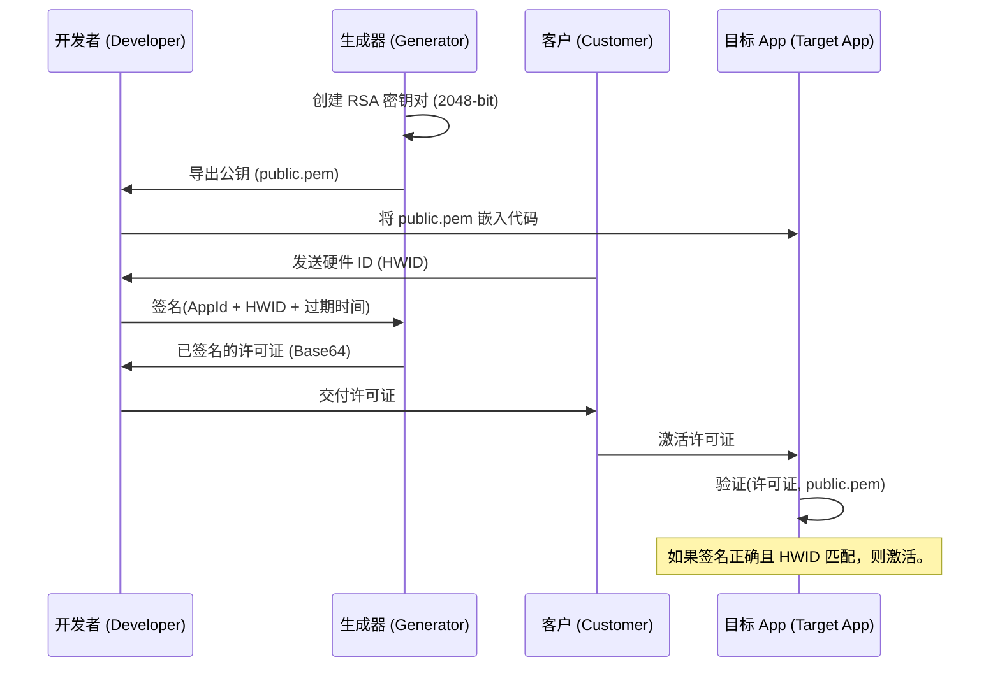

# 🏗️ 系统架构：许可证生态系统

[🇪🇸 Español](../es/ARCHITECTURE.md) | [🇺🇸 English](../../ARCHITECTURE.md) | [🇩🇪 Deutsch](../de/ARCHITECTURE.md) | [🇧🇷 Português](../pt/ARCHITECTURE.md) | 🇨🇳 **中文**

本文档详细介绍了支撑 License Generator 的技术设计和安全原则。

---

## 🔒 安全模型：RSA + SHA256

系统使用基于 RSA 的 **单向信任 (One-Way Trust)** 机制。开发者拥有“签名”的权力（私钥），而应用程序仅拥有“验证”的权力（公钥）。

### 加密流程



---

## 🛠️ 设计基础

### 1. PEM 标准 (PKCS#8)
与旧版 .NET 的 XML 格式不同，本工具使用 **PEM (Privacy-Enhanced Mail)** 标准。
- **互操作性**: 由 `-----BEGIN...` 头界定的 Base64 格式是全球标准。任何编程语言 (Python, Node.js, Java, Go, Rust 等) 都可以直接读取这些密钥，无需适配器或转换。
- **可移植性**: 生成的许可证是 RSA 签名的 JSON —— 一种通用格式。您的客户端 App 可以用任何技术编写，不必是 .NET。
- **安全性**: 私钥实现 PKCS#8 标准，公钥实现 SubjectPublicKeyInfo 标准。
- **算法**: RSA 2048-bit + SHA256 + PKCS1v15 填充 —— 业界支持最广泛的签名方案。

### 2. 硬件绑定 (HWID)
安全性不仅基于签名，还基于 **物理绑定**。
1. 客户端应用程序生成一个基于 PC 组件（CPU, 主板或 Windows MachineGuid）的标识符。
2. 生成器将此 ID 包含在许可证的签名包中。
3. 客户端验证器重新计算本地硬件 ID 并与签名中的 ID 进行比较。
4. **结果**: 如果用户盗版许可证文件并将其带到另一台 PC，HWID 将不匹配，验证器将拒绝它，即使加密签名是完美的。

### 3. 合约完整性 (`GetDataToSign`)
为了防止篡改攻击（例如手动更改 JSON 文件中的过期日期），系统会对一个 **整合块** 进行签名。

`Signature = RSA_Sign(AppId | Name | HWID | Expiration)`

如果许可证中有哪怕一个比特被更改（例如：从 2024 改为 2030），客户端将生成不同的块，签名将不再有效。

---

## 📂 数据组织

应用程序遵循 **分离存储** 模式：
- **二进制文件**: 可执行代码可以位于任何位置。
- **数据存储 (`AppData/Local`)**: 包含密钥和历史记录。

```text
LicenseGenerator/
├── Keys/
│   ├── App1/
│   │   ├── public.pem
│   │   └── private.pem
│   └── App2/
│       └── ...
└── History.json      (已颁发许可证的记录)
```
---

## ⚖️ 法律与使用模型

与许多安全工具不同，**License Generator** 不是一个无限制的开源项目。

1. **知识产权**: 签名算法的设计和生成器的架构归作者所有。
2. **EULA 许可**: 本软件受最终用户许可协议 ([LICENSE](../../LICENSE)) 管辖，允许免费用于管理您自己的应用程序（商业或非商业）的许可证，但严格禁止出售、重新分发或对生成器本身进行逆向工程。
3. **责任**: 作者不对生成的许可证的使用情况或集成它们的应用程序的安全性负责。

> [!IMPORTANT]
> 这里的重点是：作为开发者，您有责任保管好您的私钥，并正确实施客户端验证逻辑。

---

> [!NOTE]
> 这种设计允许您更新生成器，而无需触碰您的主密钥，也不会丢失客户的历史记录。
