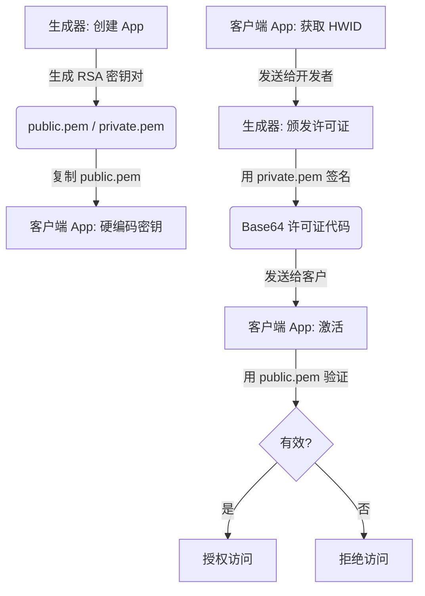

# 📔 LicenseGenerator 操作与集成指南

[🇪🇸 Español](../es/OPERATIONS.md) | [🇺🇸 English](../../OPERATIONS.md) | [🇩🇪 Deutsch](../de/OPERATIONS.md) | [🇧🇷 Português](../pt/OPERATIONS.md) | 🇨🇳 **中文**

本指南是操作生成器，尤其是**将许可证系统集成到您自己的应用程序中**的完整手册 —— 无论您使用何种编程语言。

> [!TIP]
> **主要优势**: 本系统专为那些不想（或不能）维护复杂服务器基础设施的开发者设计。它允许您简单、有条理且完全离线地管理和销售**所有 App** 的许可证。没有外部数据库，没有 API，没有月度维护成本。只有您和您的密钥。

---

## 🔄 流程概览

为了使许可证系统工作，**生成器** (您的管理工具) 和 **客户端** (终端用户的 App) 必须通过 RSA 加密进行同步。它们只需要共享**一样东西**: 公钥。



**原理**: 私钥（只有您拥有）对数据进行签名，公钥（您嵌入到 App 中）只能**验证**该签名，而无法创建签名。盗版者需要您的私钥才能为您的 App 生成有效许可证 —— 而该密钥从未离开您的电脑。

---

## 🛠 第一阶段: 生成器准备

在开始编写应用程序代码之前，您必须在生成器中注册它。这相当于告诉系统：“我需要这个产品的许可证。”

1.  **启动生成器**: 打开 `LicenseGenerator` 应用程序。
2.  **应用管理**: 转到相应选项卡并创建一个新条目，使用描述性的 **AppID** (例如: `MySuperApp`)。这个名称很重要 —— 它将把许可证与您的产品联系起来。
3.  **导出时刻**: 点击 "创建 App" 后，工具会自动执行以下操作：
    -   为该 App 生成唯一的 **2048 位** RSA 密钥对。
    -   **导出** PEM 文件到文件夹：
        `%LocalAppData%\LicenseGenerator\Keys\MySuperApp\`
4.  **找到您的公钥**: 打开刚刚在该文件夹中出现的 `public.pem` 文件。**这是您的 App 用来验证许可证是否属于您的密钥。** 别弄丢了 —— 尽管如果丢失，您可以随时从该路径再次复制。

> [!CAUTION]
> **切勿分发 `private.pem` 文件。** 这是您的私钥。如果有人获得了它，他们就能为您的 App 生成有效许可证。请像对待主密码一样对待它。

---

## 📋 基于 App 的集中管理

**License Generator** 充当您所有产品的集中控制面板：

-   **隔离**: 您注册的每个应用程序都像一个密封舱。它有自己的 RSA 密钥和许可证历史记录。`MySuperApp` 的密钥与 `OtherApp` 无关。
-   **追踪**: 在 **历史记录** 选项卡中，您可以按应用程序筛选，查看谁拥有有效许可证，何时颁发以及何时过期。
-   **客户支持**: 如果用户在许可证上遇到问题，只需在历史记录中搜索其名称或 HWID 即可重新发送代码。如果他们更换了电脑（丢失、被盗、升级），只需用新的 HWID 生成新许可证即可 —— 无需中间服务器，无复杂操作，无成本。
-   **状态控制**: 作为一个离线系统，生成器中的许可证“状态”是一个行政记录。客户端应用程序仅在本地验证签名 —— 不需要互联网来检查许可证是否有效。

---

## 💻 第二阶段: 客户端集成

这是关键部分。在这里，您的应用程序将学会验证许可证。无论语言如何，过程都是一样的：您需要 3 个基础组件。

### 组件 1: 数据合约 (`LicenseData`)

这是表示许可证的结构。**它必须在生成器和您的 App 中完全一致。** 这是双方之间的“合约”。

最关键的是 `GetDataToSign()` 方法：它生成被签名的确切字符串。如果此方法产生的结果与生成器不同，**验证将永远失败**。

````tabs
```tab=C# (.NET 6+)
public class LicenseData
{
    public string AppId { get; set; } = string.Empty;
    public string RegistrationName { get; set; } = string.Empty;
    public string HardwareId { get; set; } = string.Empty;
    public DateTime? ExpirationDate { get; set; }
    public string Signature { get; set; } = string.Empty;

    // 关键: 此方法必须与生成器中的完全一致
    public string GetDataToSign()
    {
        var dateStr = ExpirationDate?.ToString("yyyy-MM-dd") ?? "NEVER";
        return $"{AppId}|{RegistrationName}|{HardwareId}|{dateStr}";
    }
}
```
```tab=Python
import json
from dataclasses import dataclass, field
from datetime import datetime
from typing import Optional

@dataclass
class LicenseData:
    AppId: str = ""
    RegistrationName: str = ""
    HardwareId: str = ""
    ExpirationDate: Optional[str] = None  # 格式 "yyyy-MM-ddTHH:mm:ss"
    Signature: str = ""

    def get_data_to_sign(self) -> str:
        """关键: 必须生成与 C# 生成器相同的字符串"""
        if self.ExpirationDate:
            # 解析 ISO 日期并仅提取 yyyy-MM-dd
            date_str = datetime.fromisoformat(self.ExpirationDate).strftime("%Y-%m-%d")
        else:
            date_str = "NEVER"
        return f"{self.AppId}|{self.RegistrationName}|{self.HardwareId}|{date_str}"
```
```tab=Node.js
class LicenseData {
    constructor(data = {}) {
        this.AppId = data.AppId || '';
        this.RegistrationName = data.RegistrationName || '';
        this.HardwareId = data.HardwareId || '';
        this.ExpirationDate = data.ExpirationDate || null;
        this.Signature = data.Signature || '';
    }

    // 关键: 必须生成与 C# 生成器相同的字符串
    getDataToSign() {
        let dateStr = 'NEVER';
        if (this.ExpirationDate) {
            const d = new Date(this.ExpirationDate);
            dateStr = d.toISOString().split('T')[0]; // "yyyy-MM-dd"
        }
        return `${this.AppId}|${this.RegistrationName}|${this.HardwareId}|${dateStr}`;
    }
}
```
````

> [!IMPORTANT]
> **黄金法则**: `GetDataToSign()` 必须生成 **完全精确** 的字符串 `AppId|Name|HWID|yyyy-MM-dd` (或 `NEVER`)。哪怕一个字符的差异（空格、大写、日期格式），都会导致签名无效。分隔符永远是 `|`。

---

### 组件 2: 硬件标识符 (HWID)

HWID 用于防止用户将许可证复制到另一台 PC。思路很简单：您的 App 生成一个基于硬件的唯一 ID，该 ID 被包含在签名中。如果许可证到了另一台 PC，HWID 将不匹配。

**您可以使用任何方法**生成 HWID，但必须遵循两条规则：
1.  **确定性**: 同一台机器总是生成相同的 ID。
2.  **一致性**: 您的 App 显示给用户（用于发送给您）的格式，必须与后面用于验证的格式完全一致。

生成器不强制要求任何 HWID 格式 —— 它只是对接收到的内容进行签名。**由您决定如何生成它。**

````tabs
```tab=C# (.NET — Windows + Linux)
public string GetMachineId()
{
    try
    {
        string id = string.Empty;

        if (RuntimeInformation.IsOSPlatform(OSPlatform.Windows))
        {
            // Windows: 注册表中的 MachineGuid (每次安装 Windows 唯一)
            using var key = Registry.LocalMachine.OpenSubKey(@"SOFTWARE\Microsoft\Cryptography");
            id = key?.GetValue("MachineGuid")?.ToString() ?? string.Empty;
        }
        else if (RuntimeInformation.IsOSPlatform(OSPlatform.Linux))
        {
            // Linux: /etc/machine-id 是 systemd 标准
            if (File.Exists("/etc/machine-id"))
                id = File.ReadAllText("/etc/machine-id").Trim();
            else if (File.Exists("/var/lib/dbus/machine-id"))
                id = File.ReadAllText("/var/lib/dbus/machine-id").Trim();
        }
        else if (RuntimeInformation.IsOSPlatform(OSPlatform.OSX))
        {
            // macOS: 通过 ioreg 获取 IOPlatformSerialNumber
            var p = Process.Start(new ProcessStartInfo("ioreg", "-rd1 -c IOPlatformExpertDevice")
                { RedirectStandardOutput = true, UseShellExecute = false });
            var output = p?.StandardOutput.ReadToEnd() ?? "";
            var match = Regex.Match(output, "\"IOPlatformSerialNumber\" = \"(.+?)\"");
            if (match.Success) id = match.Groups[1].Value;
        }

        if (string.IsNullOrEmpty(id)) return "GENERIC-HWID";

        // 友好格式: 前 8 个字符，大写
        return id.Replace("-", "").Substring(0, 8).ToUpper();
    }
    catch { return "UNKNOWN-HWID"; }
}
```
```tab=Python
import platform, subprocess, re, uuid

def get_machine_id() -> str:
    """获取当前计算机的 8 字符 HWID。"""
    system = platform.system()
    raw_id = ""

    if system == "Windows":
        import winreg
        key = winreg.OpenKey(winreg.HKEY_LOCAL_MACHINE, r"SOFTWARE\Microsoft\Cryptography")
        raw_id = winreg.QueryValueEx(key, "MachineGuid")[0]
    elif system == "Linux":
        for path in ["/etc/machine-id", "/var/lib/dbus/machine-id"]:
            try:
                raw_id = open(path).read().strip()
                break
            except FileNotFoundError:
                continue
    elif system == "Darwin":  # macOS
        out = subprocess.check_output(["ioreg", "-rd1", "-c", "IOPlatformExpertDevice"]).decode()
        match = re.search(r'"IOPlatformSerialNumber" = "(.+?)"', out)
        if match:
            raw_id = match.group(1)

    if not raw_id:
        raw_id = str(uuid.getnode())  # 备选: MAC 地址

    return raw_id.replace("-", "")[:8].upper()
```
```tab=Node.js
const os = require('os');
const crypto = require('crypto');
const { execSync } = require('child_process');

function getMachineId() {
    let rawId = '';

    if (process.platform === 'win32') {
        // Windows: 从注册表读取 MachineGuid
        const output = execSync(
            'reg query HKLM\\SOFTWARE\\Microsoft\\Cryptography /v MachineGuid'
        ).toString();
        const match = output.match(/MachineGuid\s+REG_SZ\s+(.+)/);
        if (match) rawId = match[1].trim();
    } else if (process.platform === 'linux') {
        const fs = require('fs');
        for (const p of ['/etc/machine-id', '/var/lib/dbus/machine-id']) {
            try { rawId = fs.readFileSync(p, 'utf-8').trim(); break; } catch {}
        }
    } else if (process.platform === 'darwin') {
        const out = execSync('ioreg -rd1 -c IOPlatformExpertDevice').toString();
        const match = out.match(/"IOPlatformSerialNumber" = "(.+?)"/);
        if (match) rawId = match[1];
    }

    if (!rawId) rawId = os.hostname(); // 备选
    return rawId.replace(/-/g, '').substring(0, 8).toUpperCase();
}
```
````

> [!NOTE]
> **为什么是 8 个字符?** 纯粹为了易用性。一个完整的 GUID 如 `a8c3f1e2-b456-7890-cdef-1234567890ab` 很难在电话里念出来或输入。前 8 个字符 (`A8C3F1E2`) 足以区分数以百万计的计算机，用户也很容易复制。

---

### 组件 3: 许可证服务 (完整版)

这就是汇聚一切的地方。您的 App 需要这 4 个核心功能：

1.  **`GetMachineId()`** — 向用户展示 HWID 以便发送给您。
2.  **`Activate(code)`** — 解码并验证您发给客户的 Base64 代码。
3.  **`IsLicensed()`** — 快速检查是否有有效许可证（启动 App 时调用）。
4.  **`Validate(license)`** — RSA 加密验证逻辑。

````tabs
```tab=C# (.NET 6+) — 完整实现
using System.Security.Cryptography;
using System.Text;
using System.Text.Json;

public interface ILicenseService
{
    bool IsLicensed();
    bool Activate(string licenseKey);
    LicenseData? GetCurrentLicense();
    string GetMachineId();
}

public class LicenseService : ILicenseService
{
    private const string AppId = "MySuperApp";     // 必须与生成器中的 ID 匹配
    private const string LicenseFileName = "license.lic";

    // 从生成器导出的 public.pem 文件内容粘贴至此
    private const string PublicKeyPem = @"-----BEGIN PUBLIC KEY-----
YOUR_FULL_PUBLIC_KEY_HERE
WITH_HEADERS_AND_EVERYTHING
-----END PUBLIC KEY-----";

    private LicenseData? _cachedLicense;

    // ══════════════════════════════════════════════════════════════
    // 1. 检查: 是否有有效许可证? (启动时调用)
    // ══════════════════════════════════════════════════════════════
    public bool IsLicensed()
    {
        if (_cachedLicense != null) return true;

        // 尝试从磁盘加载 (如果之前已激活)
        var license = LoadFromFile();
        if (license != null && Validate(license))
        {
            _cachedLicense = license;
            return true;
        }
        return false;
    }

    // ══════════════════════════════════════════════════════════════
    // 2. 激活: 用户粘贴您发送的 Base64 代码
    // ══════════════════════════════════════════════════════════════
    public bool Activate(string licenseKey)
    {
        try
        {
            // 生成器生成: Base64 → 里面是 JSON → 里面是数据
            var json = Encoding.UTF8.GetString(Convert.FromBase64String(licenseKey));
            var license = JsonSerializer.Deserialize<LicenseData>(json);

            if (license != null && Validate(license))
            {
                SaveToFile(licenseKey);       // 持久化保存以便下次启动
                _cachedLicense = license;
                return true;
            }
        }
        catch { /* 格式无效 — 代码被破坏或复制错误 */ }
        return false;
    }

    public LicenseData? GetCurrentLicense() => _cachedLicense;

    // ══════════════════════════════════════════════════════════════
    // 3. 验证: RSA 加密验证
    // ══════════════════════════════════════════════════════════════
    private bool Validate(LicenseData license)
    {
        // 是给这个 App 的吗?
        if (license.AppId != AppId) return false;

        // 硬件是否匹配?
        if (license.HardwareId != GetMachineId()) return false;

        // 是否过期?
        if (license.ExpirationDate.HasValue && license.ExpirationDate < DateTime.Now) return false;

        try
        {
            // RSA 签名验证: 导入公钥并验证
            using var rsa = RSA.Create();
            rsa.ImportFromPem(PublicKeyPem);

            var data = Encoding.UTF8.GetBytes(license.GetDataToSign());
            var signature = Convert.FromBase64String(license.Signature);

            return rsa.VerifyData(data, signature, HashAlgorithmName.SHA256, RSASignaturePadding.Pkcs1);
        }
        catch { return false; }
    }

    // ══════════════════════════════════════════════════════════════
    // 4. HWID: PC 唯一标识 (见上一节)
    // ══════════════════════════════════════════════════════════════
    public string GetMachineId()
    {
        // ... (使用上一节的代码)
    }

    // ══════════════════════════════════════════════════════════════
    // 持久化: 保存/加载文件
    // ══════════════════════════════════════════════════════════════
    private void SaveToFile(string licenseKey)
    {
        File.WriteAllText(GetLicensePath(), licenseKey);
    }

    private LicenseData? LoadFromFile()
    {
        var path = GetLicensePath();
        if (!File.Exists(path)) return null;
        try
        {
            var key = File.ReadAllText(path);
            var json = Encoding.UTF8.GetString(Convert.FromBase64String(key));
            return JsonSerializer.Deserialize<LicenseData>(json);
        }
        catch { return null; }
    }

    private string GetLicensePath()
    {
        var dir = Path.Combine(
            Environment.GetFolderPath(Environment.SpecialFolder.LocalApplicationData),
            AppId  // 每个 App 将许可证保存在此文件夹
        );
        if (!Directory.Exists(dir)) Directory.CreateDirectory(dir);
        return Path.Combine(dir, LicenseFileName);
    }
}
```
```tab=Python — 完整实现
import base64, json, os, platform
from cryptography.hazmat.primitives import hashes, serialization
from cryptography.hazmat.primitives.asymmetric import padding, utils

# 需要: pip install cryptography

APP_ID = "MySuperApp"
LICENSE_FILE = "license.lic"

# 从生成器导出的 public.pem 文件内容
PUBLIC_KEY_PEM = """-----BEGIN PUBLIC KEY-----
YOUR_FULL_PUBLIC_KEY_HERE
WITH_HEADERS_AND_EVERYTHING
-----END PUBLIC KEY-----"""

_cached_license = None

def get_license_path() -> str:
    """激活的许可证保存路径。"""
    if platform.system() == "Windows":
        base = os.environ.get("LOCALAPPDATA", os.path.expanduser("~"))
    else:
        base = os.path.expanduser("~/.local/share")
    directory = os.path.join(base, APP_ID)
    os.makedirs(directory, exist_ok=True)
    return os.path.join(directory, LICENSE_FILE)

def validate(license: 'LicenseData') -> bool:
    """完整的 RSA 加密验证。"""
    if license.AppId != APP_ID:
        return False
    if license.HardwareId != get_machine_id():
        return False
    if license.ExpirationDate:
        from datetime import datetime
        exp = datetime.fromisoformat(license.ExpirationDate)
        if exp < datetime.now():
            return False
    try:
        public_key = serialization.load_pem_public_key(PUBLIC_KEY_PEM.encode())
        data = license.get_data_to_sign().encode("utf-8")
        signature = base64.b64decode(license.Signature)
        public_key.verify(
            signature,
            data,
            padding.PKCS1v15(),
            hashes.SHA256()
        )
        return True
    except Exception:
        return False

def activate(license_key: str) -> bool:
    """解码生成器的 Base64，验证并持久化。"""
    global _cached_license
    try:
        json_str = base64.b64decode(license_key).decode("utf-8")
        data = json.loads(json_str)
        license = LicenseData(**data)
        if validate(license):
            with open(get_license_path(), "w") as f:
                f.write(license_key)
            _cached_license = license
            return True
    except Exception:
        pass
    return False

def is_licensed() -> bool:
    """检查是否有有效许可证 (App 启动时)。"""
    global _cached_license
    if _cached_license:
        return True
    path = get_license_path()
    if not os.path.exists(path):
        return False
    try:
        key = open(path).read()
        json_str = base64.b64decode(key).decode("utf-8")
        data = json.loads(json_str)
        license = LicenseData(**data)
        if validate(license):
            _cached_license = license
            return True
    except Exception:
        pass
    return False
```
```tab=Node.js — 完整实现
const crypto = require('crypto');
const fs = require('fs');
const path = require('path');
const os = require('os');

const APP_ID = 'MySuperApp';
const LICENSE_FILE = 'license.lic';

// 从生成器导出的 public.pem 文件内容
const PUBLIC_KEY_PEM = `-----BEGIN PUBLIC KEY-----
YOUR_FULL_PUBLIC_KEY_HERE
WITH_HEADERS_AND_EVERYTHING
-----END PUBLIC KEY-----`;

let cachedLicense = null;

function getLicensePath() {
    const base = process.platform === 'win32'
        ? process.env.LOCALAPPDATA || os.homedir()
        : path.join(os.homedir(), '.local', 'share');
    const dir = path.join(base, APP_ID);
    if (!fs.existsSync(dir)) fs.mkdirSync(dir, { recursive: true });
    return path.join(dir, LICENSE_FILE);
}

function validate(license) {
    if (license.AppId !== APP_ID) return false;
    if (license.HardwareId !== getMachineId()) return false;
    if (license.ExpirationDate && new Date(license.ExpirationDate) < new Date()) return false;
    try {
        const data = Buffer.from(license.getDataToSign(), 'utf-8');
        const signature = Buffer.from(license.Signature, 'base64');
        const verify = crypto.createVerify('SHA256');
        verify.update(data);
        return verify.verify(PUBLIC_KEY_PEM, signature);
    } catch { return false; }
}

function activate(licenseKey) {
    try {
        const json = Buffer.from(licenseKey, 'base64').toString('utf-8');
        const data = JSON.parse(json);
        const license = new LicenseData(data);
        if (validate(license)) {
            fs.writeFileSync(getLicensePath(), licenseKey);
            cachedLicense = license;
            return true;
        }
    } catch {}
    return false;
}

function isLicensed() {
    if (cachedLicense) return true;
    const licensePath = getLicensePath();
    if (!fs.existsSync(licensePath)) return false;
    try {
        const key = fs.readFileSync(licensePath, 'utf-8');
        const json = Buffer.from(key, 'base64').toString('utf-8');
        const data = JSON.parse(json);
        const license = new LicenseData(data);
        if (validate(license)) {
            cachedLicense = license;
            return true;
        }
    } catch {}
    return false;
}
```
````

**每个部分是做什么的？**

1.  生成器生成一个包含 `AppId`, `RegistrationName`, `HardwareId`, `ExpirationDate` 和 `Signature` 的 JSON，所有这些都编码在 **Base64** 中。此 Base64 块是您发送给客户的内容。
2.  客户端 **解码** Base64 → 获取 JSON → 反序列化为 `LicenseData`。
3.  验证器 **重建** `GetDataToSign()` 字符串，并使用公钥验证该字符串是否由您的私钥签名。
4.  如果通过，文件 `license.lic` 将保存在用户的 AppData 中，以便他们不需要每次打开 App 都激活。

---

## 🎨 第三阶段: App 中的激活屏幕

您的 App 需要一个屏幕，用户可以在其中：
- **查看他们的 HWID** (以便发送给您)。
- **粘贴许可证代码** (您发给他们的)。
- **激活** 并查看结果。

无论您的界面是控制台、Web 还是桌面，概念都是一样的：

```
┌──────────────────────────────────────────────┐
│           🔑 激活许可证 (Activate)           │
│                                              │
│  您的机器 ID:   [ A8C3F1E2 ]  [📋 复制]      │
│                                              │
│  许可证代码:                                 │
│  ┌──────────────────────────────────────┐    │
│  │ (用户在此粘贴 Base64 代码)            │    │
│  └──────────────────────────────────────┘    │
│                                              │
│               [ ✅ 激活 ]                    │
│                                              │
│  状态: ❌ 未授权 (Not Licensed)              │
└──────────────────────────────────────────────┘
```

**最终用户的流程是:**
1.  打开您的 App → 看到激活屏幕。
2.  复制 HWID 并将其发送给您（通过电子邮件、Web 表单等）。
3.  您打开生成器 → 选择 App → 粘贴 HWID → 点击生成。
4.  将生成的 Base64 代码发回给他们。
5.  客户端将其粘贴到 App 中 → 点击激活 → 完成。

---

## 🎫 第四阶段: 颁发许可证 (日常操作)

当客户想要购买您的 App 时，过程很快：

1.  **索取 HWID**: 您的客户端 App 已经有了 "复制 ID" 的按钮。
2.  **打开生成器**: 选择相应的 App。
3.  **填写详情**:
    -   **客户**: 买家名称 (为您自己记录)。
    -   **HWID**: 他们发送的 8 字符代码。
    -   **过期时间**: 选择一个日期，或留空以生成永久许可证。
4.  **生成**: 点击按钮，您将获得长长的 Base64 块。
5.  **发送**: 复制该块，并通过您喜欢的方式发送给客户。

> [!NOTE]
> 每个生成的许可证都会自动注册在生成器的 **历史记录** 中。您可以随时查询以查看您颁发了多少许可证，给谁颁发的，以及何时过期。

---

## 🚫 不可逆性与撤销

> [!CAUTION]
> **签名是永久的**: 由于此系统使用离线非对称加密，已签名的许可证在技术上在客户端 PC 上永久有效（或直到过期日期），无需互联网。

**我可以撤销已交付的许可证吗？**

-   **远程撤销: 否。** 由于没有客户端在启动时查询的中央服务器，您无法远程“关闭”许可证。
-   **黑名单 (Blacklist): 是。** 您可以在 App 的下一次更新中实施“黑名单”。如果您在代码中包含已撤销签名的列表，验证逻辑可以拒绝这些许可证，即使 RSA 签名是正确的。
-   **通过主版本: 是。** 如果您在新版本中更改 **公钥** (例如：从 V1 到 V2)，所有以前的许可证在该版本中都将失效。这对于收费的大版本更新很有用。

---

## 🌍 技术栈兼容性

此系统 **不** 局限于 .NET / C#。生成器使用任何语言都支持的工业加密标准：

| 组件 | 使用标准 | 通用吗？ |
|:---|:---|:---|
| RSA 密钥 | **PEM (PKCS#8 / SubjectPublicKeyInfo)** | ✅ 是 — 全球格式 |
| 签名算法 | **RSA + SHA256 + PKCS1v15** | ✅ 是 — 所有加密库都支持 |
| 许可证格式 | **Base64 编码的 JSON** | ✅ 是 — 不依赖 .NET |
| 签名格式 | **Base64** | ✅ 是 — 通用 |

**您可以在任何技术栈中验证许可证:**

| 语言/栈 | RSA/PEM 库 | 难度 |
|:---|:---|:---|
| **C# / .NET 6+** | `System.Security.Cryptography` (原生) | ⭐ 极简 |
| **Python** | `cryptography` (pip install) | ⭐ 极简 |
| **Node.js** | `crypto` (原生模块) | ⭐ 极简 |
| **Java / Kotlin** | `java.security` (原生) | ⭐⭐ 简单 (需要 KeyFactory) |
| **Rust** | `rsa` + `pem` crates | ⭐⭐ 简单 |
| **Go** | `crypto/rsa` (stdlib) | ⭐⭐ 简单 |
| **Swift** | `Security` framework | ⭐⭐ 简单 |
| **Electron / Web** | Node.js `crypto` 或 Web Crypto API | ⭐⭐ 简单 |

> [!TIP]
> **生成器只是管理工具。** 它作为一个桌面应用 (.NET) 存在于您的 PC 上。但它生成的许可证是 **RSA 签名的 JSON 文件** —— 任何语言编写的任何程序都能读取和验证。您的客户端 App 可以是用 Python, Java, React, Electron, Flutter 或任何其他技术编写的。

---

## ⚠️ 常见问题排查

| 问题 | 可能原因 | 解决方案 |
| :--- | :--- | :--- |
| **"签名错误 (Signature Error)"** | 公钥与用于签名的私钥不匹配，或 `GetDataToSign()` 生成的字符串不同。 | 重新复制完整的 `public.pem` 内容（包括 `BEGIN/END` 头）。检查 `\|` 分隔符是否正确。 |
| **"许可证在此 PC 无效"** | 客户端 PC 生成的 HWID 与您签名时输入的 HWID 不同。 | 确保您的 App 使用与生成器接收到的**完全相同的 HWID 算法**。注意大小写。 |
| **"许可证已过期"** | 客户端 PC 的日期晚于 `ExpirationDate`。 | 生成一个日期延长的许可证。 |
| **"导入 PEM 错误"** (C#) | 缺少 `System.Security.Cryptography` 或使用 .NET < 6。 | 升级到 .NET 6+，它包含原生的 `ImportFromPem()`。 |
| **"导入 PEM 错误"** (Python) | 缺少 `cryptography` 库。 | 执行 `pip install cryptography`。 |
| **许可证在开发环境有效但在生产环境无效** | 发布的 App 使用了不同的 HWID (例如：Docker 容器有不同的 `machine-id`)。 | 检查生产环境是否允许访问相同的硬件数据。 |
